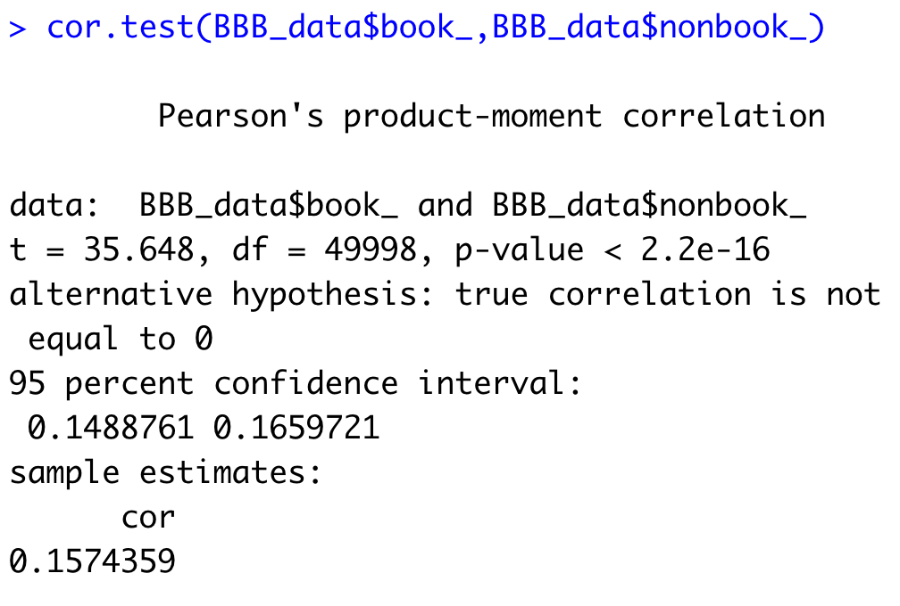
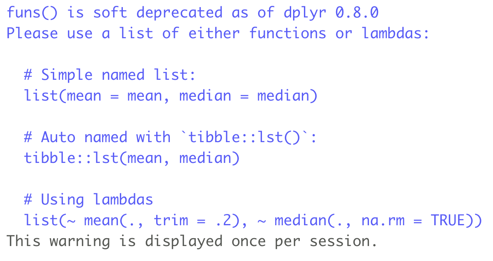
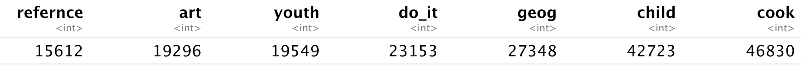
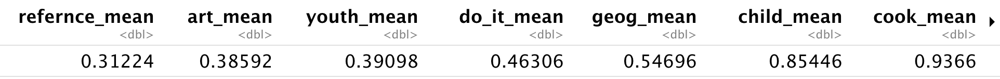
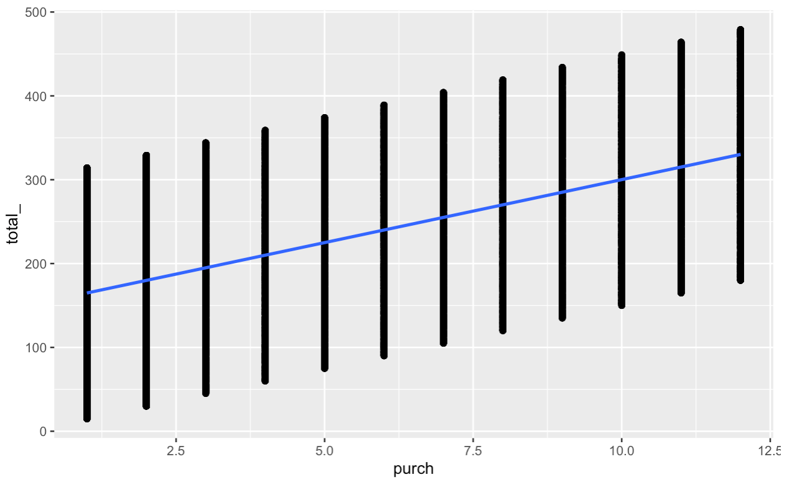
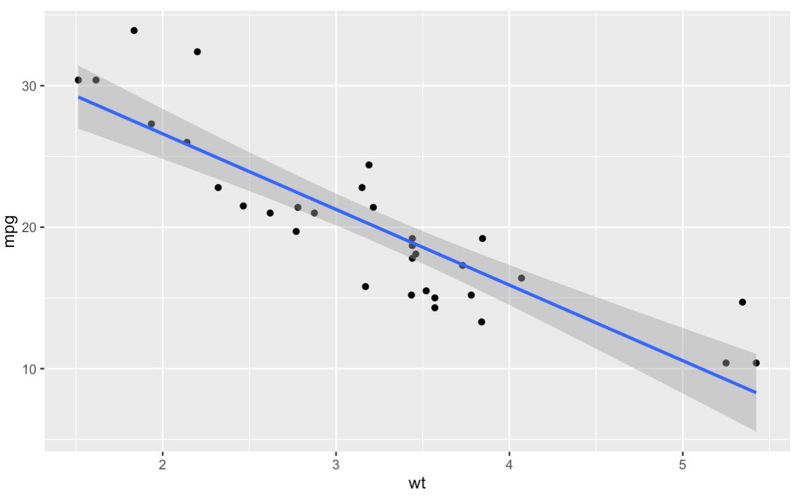
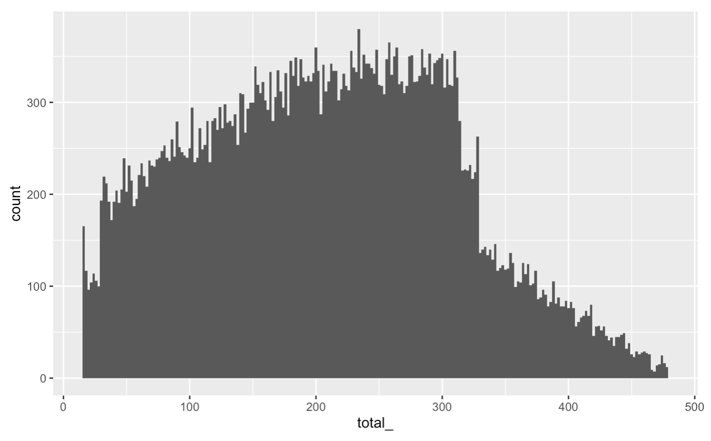

```
library(tidyverse) 
library(gmodels)
```

#### knitr

ctrl+shift+M - pipe

```R
library(knitr)
BBB_data %>% 
  group_by(state) %>% 
  summarize(num_customers=n()) %>% 
  arrange(desc(num_customers)) %>% 
  mutate(freq=num_customers/sum(num_customers)) %>%
  kable(digits=2)
```

Kable enables us to limit the digits in result

#### cor.test()

```R
cor.test() ## output the correlation coefficients and also the p-value
```



#### Get statistics of each column and sort

```R
BBB_data %>% 
  select(child,youth,cook,do_it,refernce,art,geog) %>% ## select seven columns
  colSums() %>% ## also rowSums(), sum along the columns or rows
  sort(descending=TRUE) ## sort by descending
```

```R
## in dplyr, summarize each (summarize at column dimension, with many statistics)
## old version, with a warning; better version below
BBB_data %>% 
  select(child,youth,cook,do_it,refernce,art,geog) %>% 
  summarize_each(funs(sum)) %>% 
  sort(descending=TRUE)
```





```R
BBB_data %>% 
  select(child,youth,cook,do_it,refernce,art,geog) %>% 
  summarize_each(list(sum=sum,mean=mean)) %>% ## add a suffix(_sum,_mean) with each column
  sort(descending=TRUE)
```



#### bar chart

```{r}
spending_gender <- BBB_data %>% 
  group_by(gender) %>% 
  summarize(total_books=mean(book_)) %>% 
  arrange(desc(total_books))

bar_plot <- ggplot(data = spending_gender,
                   aes(x=gender,y=total_books))+
  labs(x="gender",y="total spending on books")+
  geom_bar(stat="identity",width = 0.5) ## stat="identity" (default: count the number of males or females, rather than using total_books; identity tells R to use true y to be the size of the barchart)
bar_plot 
```

#### Scatter plot

```{r}
scatter_plot_sample <- ggplot(BBB_data,aes(x=purch,y=total_))+
  geom_point()+ ## too many points which even make up vertical lines
  geom_smooth(method=lm)
scatter_plot_sample
```



```{r}
scatter_plot_sample <- ggplot(mtcars,aes(x=wt,y=mpg))+
  geom_point()+ ## too many points which even make up vertical lines
  geom_smooth(method=lm)
scatter_plot_sample
```



#### Histogram

##### Rule of thumbs for bin width in histogram

1. bin=round up the square root of #obs

   ```R
   bin=round(sqrt(length(BBB$total_)))
   ```

2. Calculate the value of (max-min)

   ```R
   max_min <- diff(range(BBB$total_))
   ```

3. binwidth

   ```R
   binwidth <- round(max_min/bin)
   ```

```{r}
histogram_sample <- ggplot(BBB_data,aes(x=total_))+
  geom_histogram(binwidth = 2) ## the number of the bins is 30 with default; specify the binwidth
histogram_sample
```



