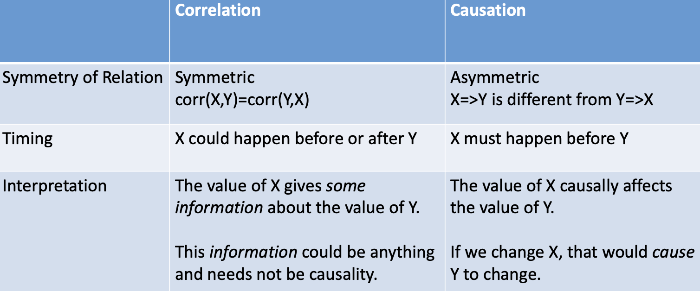

#### Decision Making 1.0: HiPPO

Highest Paid Person's Opinion

Based on HiPPO can be dangerous. 

#### Decision Making 2.0: Data-Driven Decision

##### Prediction and Causal Inference

- Predictive analytics: discovering correlations in the data
- Causal inference: understanding the process that has generated the correlations in the first place
  - Necessary for evaluating impact 

##### Why measure impact?

- Potential options for the decision
- Optimal decision critically depends on accurate measurement 
- Optimal decision = the option that maximizes outcome

##### Examples to measure impact

- Advertising: will my sales increase? By how much? How will advertising on a new channel change my total sales? (Based on historical data on sales)
- Pricing: if increase the price, what will happen to the sales of the product or other products? If my competitors increase the price, what will happen to the sales of my products?
- Product design
- Information design
- Human bias: algorithm to screen resumes
- Health: drink a glass of wine will increase life expectancy?

##### Measuring impact is difficult

- **<u>Correlation</u> does not imply <u>causation</u>**
- Causal inference requires a more subtle and nuanced interpretation of data compared to predictions
- But it can deliver stark recommendations on what a person, a firm, a government should do
- Therefore skills for causal inference is very valuable

### Module 1: Prediction Vs. Causation

#### Predictive analytics

- Predictive analytics: discovering correlations in the data • Correlation: How different variables move together.
- Steps for performing predictive analytics
  - Outcome: Y. Predictors: X’s.
  - **Split** into training dataset and test dataset
  - Fit different models to the training dataset and find the best model M (based on performance in test dataset)
  - Use M to predict outcomes

#### Idea of Predictive Analytics

#### Causal Inference

- Definition: statistical inference on causal relation between variables. • Causal relation: <u>How</u> does a change in X cause Y to change?
- Causation is defined in terms of the **counterfactual(s)** • For simplicity, X is binary (0/1). Counterfactuals:
  - If I do X, what will happen to Y? Call this Y(1)
  - If I do not do X, what will happen to Y? Call this Y(0)
  - The causal effect of X on Y is Y(1) – Y(0)

- Problem: we **never observe both** Y(1) and Y(0) • We can’t “do X” and “not do X” at the same time

- In the data, we observe **either** Y(1) **or** Y(0) for a subject.

- Counterfactuals: 

  - If I have done X (X=1):
  - What would have Y been, had I not done X.

  **OR**

  - If I have not done X (X=0):
     What would have Y been, had I done X.

- Causal effect of X on Y: The difference between Y in reality and Y in the counterfactual world.

#### Missing Data Problem

- Causal inference is a really a missing data problem.
- We do not observe outcome in a counterfactual world where the “treatment status” is the opposite (to reality).
  - In our case, we have attended grad school, so we don’t observe salary in a hypothetical world where we haven’t attended grad school.
  - Similarly, my mom never attended grad school, so she doesn’t observe her salary in a hypothetical world where she has attended grad school.
- How do we do causal inference then?
- We need smart **research designs** to estimate the missing data 
- We will spend much time learning these designs.

### Some Properties of Causation

#### 1. Causation Needs Not Be Deterministic

- “X causes Y” does not mean X always cause Y
- It means that if X happens, Y is more likely to happen.
- Ex 1: Smoking and lung cancer
- Ex 2: Wearing seatbelt and fatality 
- Ex 3: Attending lectures and exam scores

#### 2. Causation Needs Not Be Unique

- “X causes Y” does not mean X is the only cause of Y.
- It means X is one cause of Y, possible among others.
- Example: Not wearing seatbelt, drink and driving sober, and texting while driving all increase fatality.

#### 3. Prediction (Correlation) Vs Causation

### Prediction or Causal Inference?

#### Two Types of Decisions

- Prediction decision problems • Decisions based on prediction
- Causal decision problems
  - Decisions based on causal inference
- Mathematical definition is not straightforward. Let’s look at examples.

#### Prediction Decision Problems: An Example

- Should I take an umbrella to school tomorrow? 
- This decision only involves prediction:
  - How likely is it going to rain tomorrow?
- Predictive analytics
  - Outcome variable: rain tomorrow? (0/1)
  - Predictors:
    - Rain today?
  - Historical rain probability from previous years
  - Mercury levels on the barograph
    - Movement of the cloud
  - Predictive modeling: logistic regressions, trees, random forest, neural network, etc.
- Decision: If !"(Rain) is high, then take an umbrella. Otherwise, don’t.

#### Causal Inference: An Example

- Decisions to make:
  - Should Ted hire a teacher to teach him rain dance?
  - Should a state government invest in a rain dance after a wildfire?
  - Should an agriculture company hire rain dancers after a period of draught?
- These decisions involve causal inference: • Do rain dances cause rain?
- Thinking in terms of counterfactual:
  1. If I perform a rain dance, the probability of rain is !"(1)
  2. If I don’t perform a rain dance, the probability of rain is !"(0)
- If !"(1) − !"(0) is large enough, then do/invest in a rain dance. Otherwise, don’t.

**UPSTREAM: causation**

**DOWNSTREAM: predictions** 

 

#### Focus of this course

- Upstream decision making.
- Causal inference is of paramount importance in decision making 
  - True for individuals, businesses, and governments.

#### Examples

- Should I get a MSA degree to increase my data skill? **causality**
- Does a glass of wine every day to increase my life expectancy? **causality**
- Does marriage increase happiness? **causality**
- Should a professor appoint someone who regularly come to class as TA in the coming semester? **prediction** (professor uses skills as an input, he only cares about the skills)

- Should my company adopt a vertical organizational structure or a flat organizational structure for a higher communication efficiency? **causality**
- If I increase annual fee of a credit card, how many consumers will cancel the card? **causality**
- Does working from home increase employee’s productivity? **causality** 

### What do data say? What do data mean?

#### What Do Data Say: Averages

- Data tells us the average value of a random variable X • Mean: !(#)

- It’s important to understand the averages.
  - Ex 1: Knowing the average return of advertising helps an advertiser to decide how much to advertise.

  - Ex 2: Bath & Body Works wants to outsource its wallflowers production to a factory in Cambodia. It needs to know what is the average shipping time from Cambodia to the U.S. to get their new products on shelf each season.

#### What Do Data Say: Variability

- Data tells us a distribution of a variable X
  - Variance: var X =&[ (−& ( ]+ measures howfarasetofnumbersare spread out from their average value
  - Shape of the distribution: E.g., skewness.
- Knowing variance and shape of the distribution is also important
  - Ex 1: Everyone will advertise is there is no variance around the mean.
  - Ex 2: B&B Works may miss their product launch date without knowing the distribution of delivery time.

#### CORRELATION DOES NOT IMPLY CAUSATION!

- Variation and co-variation in the data comes from different sources.
- The core of causal inference is to understand different sources of variations in the data.

