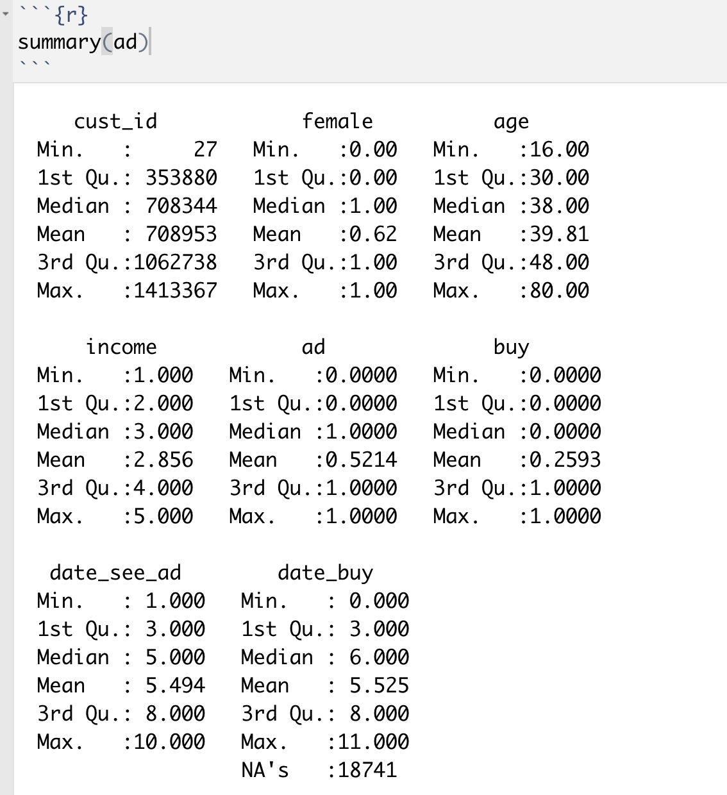
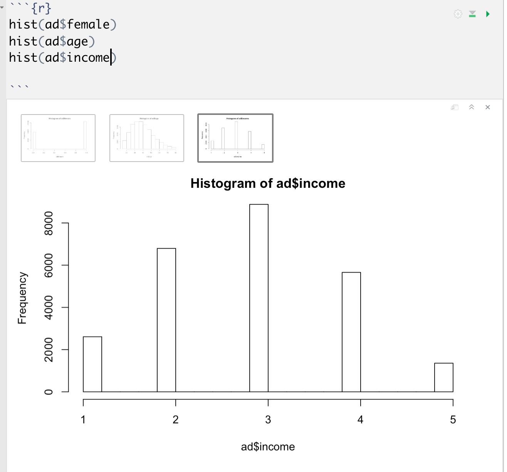
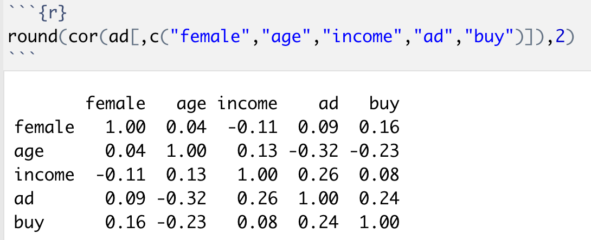
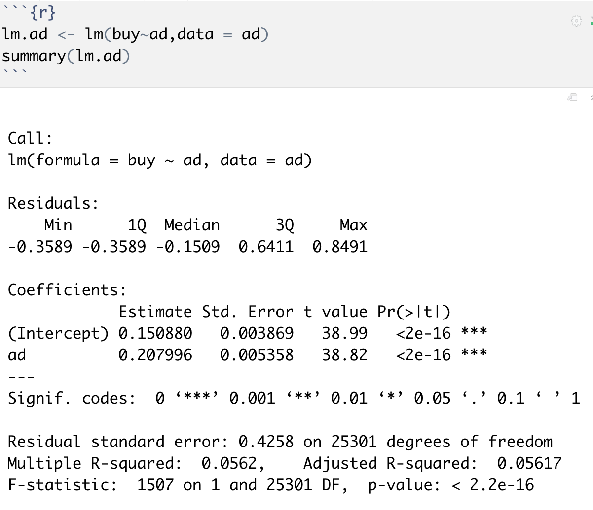
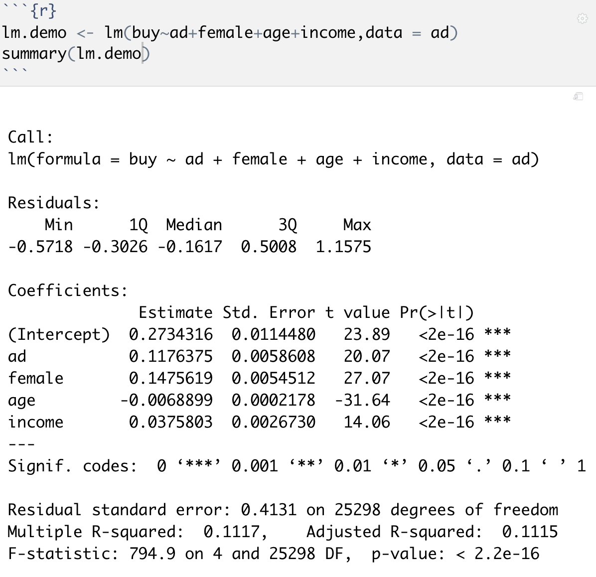
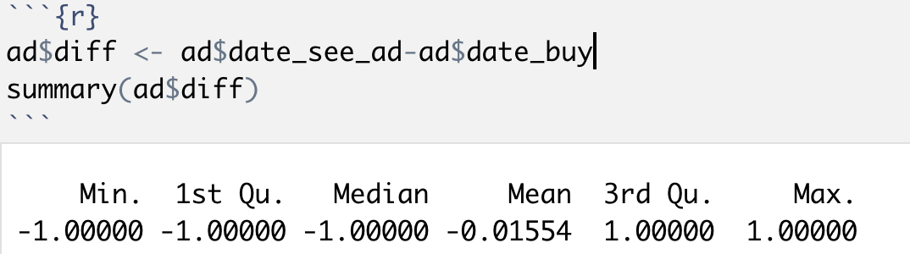
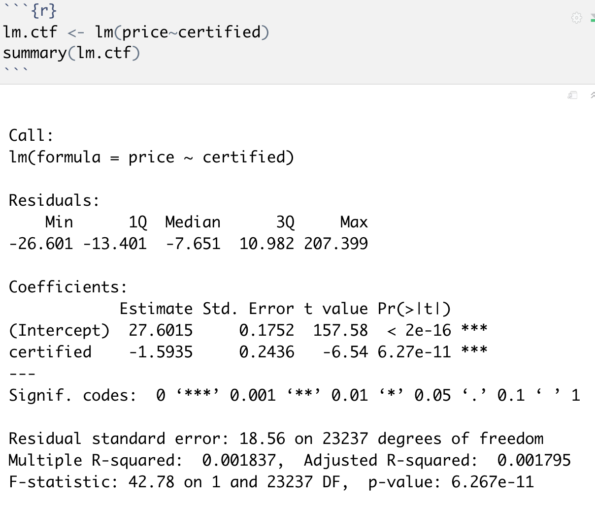
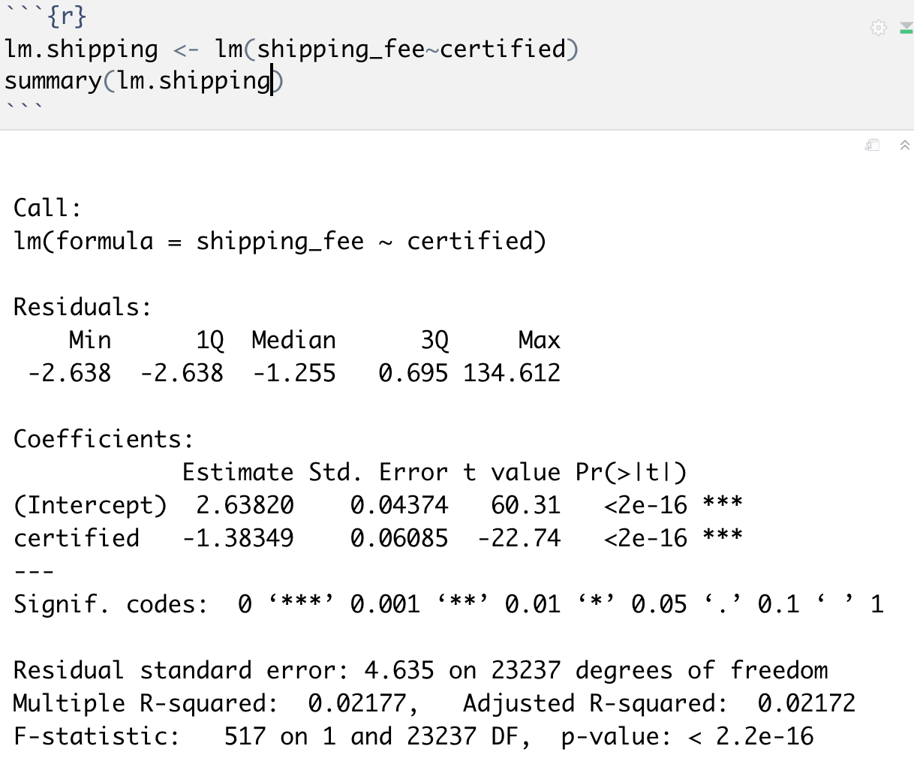
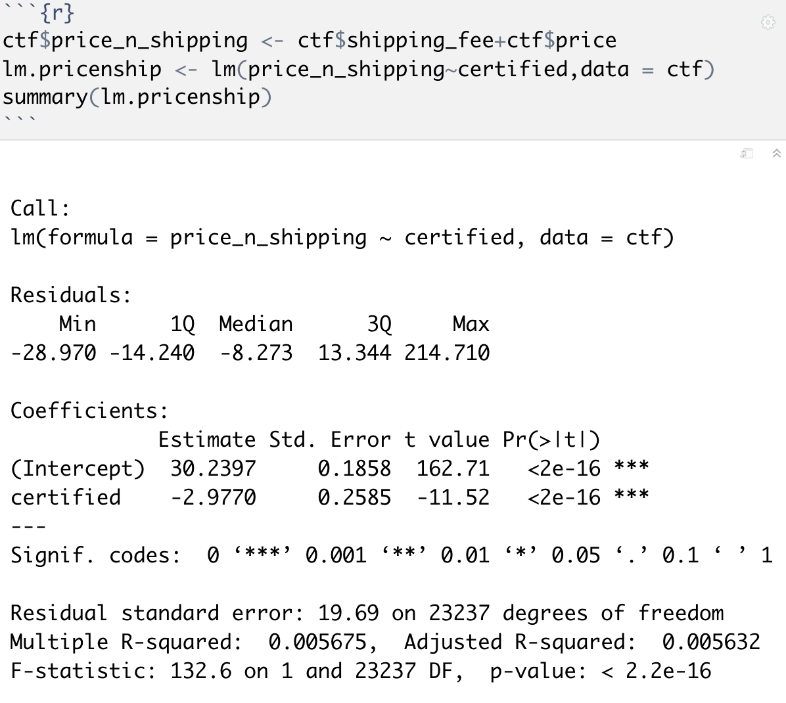

## Lab 2: Causality in real data (R)

### Key concepts from video

- Blindly regressing Y on X can cause bias
  - Selection problem: what data are more likely to be picked up by our sample
  - Omitted variable bias: there may be other relevant variables that are not accounted for
  - Reverse causality / simultaneity: causality may go the other way or both ways

### Project 1: Advertising Effectiveness

> Data: ads_effect.csv 

#### 1. Get to know the data

1. Metadata 

2. Summary

   

3. Graph out the data, one variable at a time

   1. 
   2. Income will come in buckets, not in detail

4. Pair-wise correlations between key variables

   1. 
   2. Only focus on the lower triangle because of the symmetry
   3. cor(ad, female)=0.09: females are more likely to see the ad, purchase the product
   4. Young people more likely to see the ad, and also buy the product
   5. Statistically significant?

#### 2. By regressing “buy” on “ad”, what do you learn?

- What's the average sales if there's no ad shown? intercept=0.15
- The jump of the average sales is 20% if the ad shown 
- T-value is extremely large, larger than 1.96
- P-value is lower, lower than 5%
- Should we draw the conclusion that ad causes buy?

#### 3. OVB (omitted variable bias)? How can demographics help us?

- They are all statistically significant because of the p-values and t-values
- Going back to the correlations:
  - Female is positively correlated to buy
  - Young people are more likely to buy, as well as income
  - Female/ young is more likely to be targeted by the ad
- When both 1 and 2 happen, not controlling for these variables will cause bias of the estimate of ad, because ad will **pick up effects** of these variables besides its own effect

#### 4. Reverse Causality?

- Both ad and buy are measured in the 11 week interval
- Some people might see the ads after they've purchased the item
  - Purchase week=3 and ad week =5
  - Reverse causality
- Remove those rows with diff<0

#### 5. Summary 

- Publishers may target ad based on consumer's past behavior, instead of demo
- In fact the company later ran an experiment on the website. The treatment effect of ads is only 1%
- There's not much more we could do without research designs
  - Publishers won't share their algorithm or consumers' data 

### Project 2: certification premium

> Data: certification.txt
>
> For sellers, how much is the certification premium?

#### 1. Get to know the data

#### 2. By regressing price on certification, what do you learn?

- The coefficient is negative: being certified will hurt the price. Why?
- Possible models?
  - Certification causes lower price
  - Omitted variable bias?
  - Sample selection?

#### 3. Can shipping fee help you better understand the coefficient estimate in Question 2? 

- Maybe certified sellers charge higher shipping fee?
- Possible that price + shipping fee is higher for certified ?

- However, the result gives the opposite outcome

##### Regression with the all price

- Even more negative, so it's not because of the shipping causing most of the profit

#### 4. How can we use product code/category to better understand the effect?

Normalize the price and run the regression again

##### Conclusion:

- We observe negative correlation b/t certification status and price
- One interpretation is that certification status decreases price
- However, we discover that sellers sell products of different values
- Therefore, a direct comparison on price across two types of sellers suffer from selection bias 
- What if there are other omitted variables?
- Need research design, e.g. experiments...