## The Value of A/B Testing (Experiments)

### Terminologies

- Treatment: stimuli to subjects
- **Treatment** Group: subjects that received the treatment
- **Control** Group: subjects that did not receive the treatment
- A/B test: same as randomized experiments
  - **Field** experiments: experiments that are run in the **real world** settings.
  - **Lab** experiments: : experiments that are run in **hypothetical lab** settings. Not the focus of this class.

### Why Experiments?

- Naturally occurring data are often generated by multiple DGPs (Data generating process, Lectures 2).

- There maybe systematic differences between subjects that receive the treatment and those that do not.

  - Ex 1. firms that advertise more generally have faster growth than firms that don’t.
  - Ex 2. people who go to hospitals are sicker that those who don’t to begin with.

  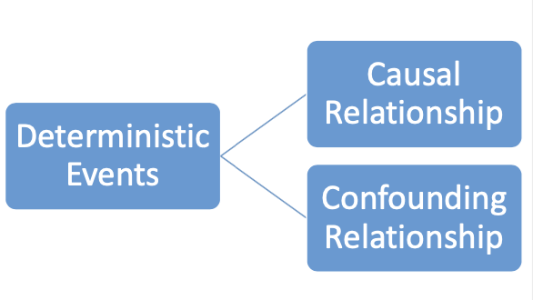

### Big Data is Not Very Useful

- “Big data” is nice, but the vast majority of data is not very useful 
  - At least, not for causal inference/measuring impact
  - Key omitted variables are often not available 
    - Google ads allocation decisions and algorithms are business secret
- Having the right kind of data is key.
- Experiment can generate the right kind of data.

### Experiments: Solution for Confounding Relationship

***Random assignment*** of the treatment status can eliminate systematic differences between treatment and control groups.

- **Random assignments**: every subject in the sample has **equal chance** of being assigned the treatment.
- Confounders in the treatment group and control group should be “balanced” and should not affect the outcome of interest.
- The **only** difference between the two groups is the **treatment status**. This allows us to understand the causal effect of the treatment.
  - Simply compare the average across the group

## The Potential Outcomes Framework

### Potential Outcomes

- **Causal inference**: understanding the “counterfactual”
- “**Potential outcomes**” formally defines “counterfactual”.

#### Example: Digital Marketing

- What is the return to advertising on Facebook.

- Nike already advertises on FB in some cities.

- For each city, we observe outcomes (total sales in millions $), and treatment status (dummy variables: FB ads or not)

- However, we do not observe the counterfactuals:
   • Counterfactual for cities <u>with</u> FB ads: what would have sales been in these cities, had they not advertised on FB.

  • Counterfactual for cities <u>without</u> FB ads: what would have sales been in these cities, had they advertised on FB.

- But as a mental exercise, let’s suppose we know the counterfactuals.

Suppose Nike sells in 6 cities, and advertising is a discrete choice (0/1)

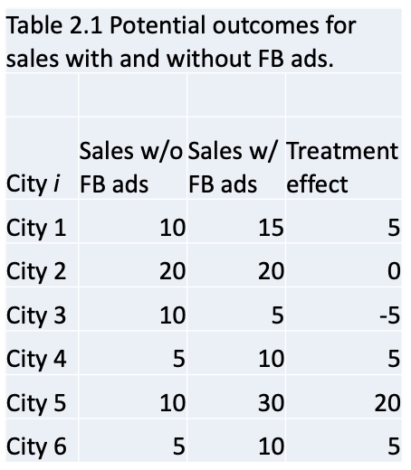

- Each city indexed by *i=1,2,...,6* 
- For each city, we have two *potential outcomes*: 1) sales with FB ads 2) sales without FB ads. One of them is realized, and the other is hypothetical.
- E.g., City 4 has sales of 10 million \$ if it advertises on FB, and has sales of 5 million \$ if it doesn’t advertises on FB, i.e.,$Y_4$(1) =10, $Y_4$(0) =5
- These are the two potential outcomes for City 4.

### !Average Treatment Effect (ATE)

$ATE=E[Y_i(1)-Y_i(0)]=E[Y_i(1)]-E[Y_i(0)]$ (Unconditional means)

However, we cannot observe. So usually we only observe:

$E[Y_i(1)|d_i=1]=E[Y_i(1)|d_i=0]=E[Y_i(1)]$ 

$E[Y_i(0)|d_i=1]=E[Y_i(0)|d_i=0]=E[Y_i(0)]$ 

Because the treatment status is **independent** of the potential outcomes, (why needs <u>random</u> assignment? )

Therefore:

$E[Y_i(1)|d_i=1]=E[Y_i(0)|d_i=0]=E[Y_i(1)]-E[Y_i(0)]=ATE$ 

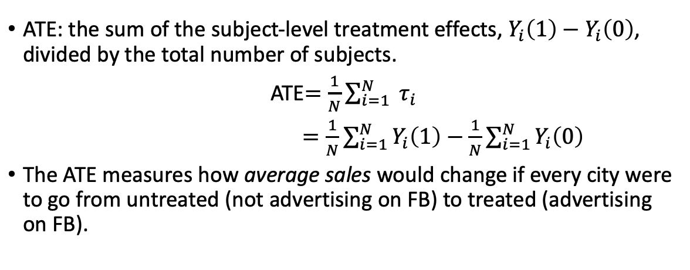

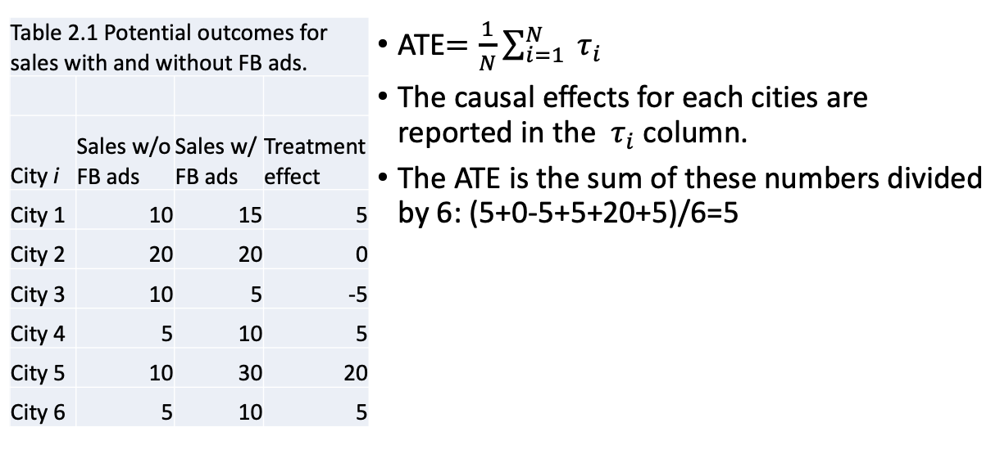

Why report ATE?

- Much more convenient than report every causal effect in every city
- In reality we never observe both potential outcomes for each city
  - Methodologies can only give us a sense of the average treatment effect, usually enough.

## Random Sampling and Expectation

### Random sampling

- Random sample: each subject in the **population** is <u>equally likely</u> to be selected in the **sample**.

  - E.g., if we take a random sample of size 2 from the 6 cities, the probability that City 1 & 3 being chosen

    = the probability that City 4 & 5 being chosen

    = the probability that <u>any other pair</u> of two cities.

### Expectation

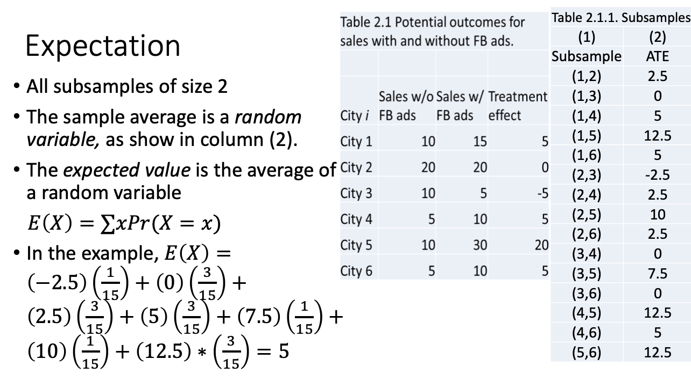

> Sort the ATE from small to large, and count the occurrence of the subsamples of each ATE

- The expected value of the average treatment effect from the 15 subsamples is exactly the same as the ATE from the entire population.

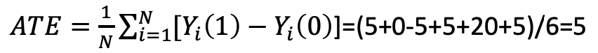

- The *law of large number*: the average of sampling means for repeated random sample should equal to the population average.
- Sample mean is an unbiased estimator of the population average.

### Conditional expectation

- *Conditional expectation* refers to subgroup averages
- 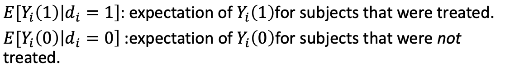 
- These two expectations are observed in reality.
- 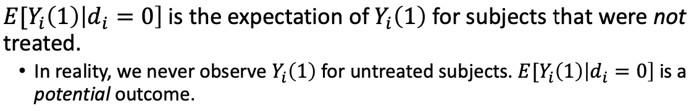 
- 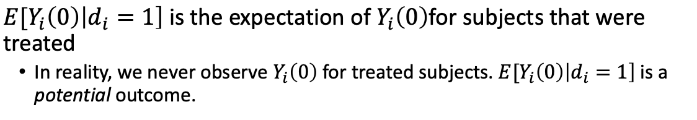 

> In a counterfactual world

#### Example: Realized vs Counterfactuals outcomes

- Examples to understand 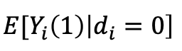
- You applied for both WashU and BU. You ended up coming to WashU. But you wonder how your life would be, had you gone to BU.
  - The treatment is going to BU, and the untreated is status quo (WashU). Even though you end up in WashU ($d_i=0$), you can nevertheless imagine what would have your life been in the counterfactual, had you gone to BU ($Y_i(1)$)
- Your United flight to Chicago has been delayed for an hour. You wonder what would have happened had you booked a flight from Southwest.
  - The treatment is flying with Southwest, and the untreated is status quo (United). You’ve already bought the ticket from United  ($d_i=0$),, and you cannot change to Southwest at this stage. But you could still *imagine* the *counterfactual* scenario.

## Random Assignment and Unbiased Inference

### We Never Observe Both Potential Outcomes

- The challenge of estimating ATE is that we only observe either Yi(1) or Yi(0), but never both.
- In reality, we would observe this...

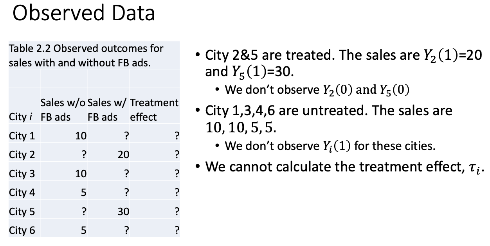

### We Cannot Directly Compare Treated And Control Groups

- Lecture 2: why treated non-treated subjects are not comparable. (Pre-existing condition)
  - Ex 1: Companies that raise price may be different than companies that do not in terms of marketing activities
  - Ex 2: Companies that advertise may be different than companies that do not in terms of managerial ability
  - Ex 3: People that go to grad school may be different than those that do not in terms of their ability
- Missing data on potential outcomes may **not** be **random**.

### Random Assignment Addresses “Missing Data”

-  Random assignment addresses “missing data” problem by creating two groups that are on average identical prior to the treatment.
  - The expected potential outcome among cities in the treatment group are identical to the average potential outcomes among all cities.
- Therefore, we can attribute the difference in outcomes to the treatment.

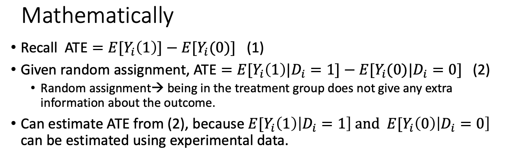

### Formalizing Selection Bias

Without random assignment, equation (2) does not hold. Add and subtract 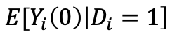 

**Expected difference** between treated and untreated outcomes

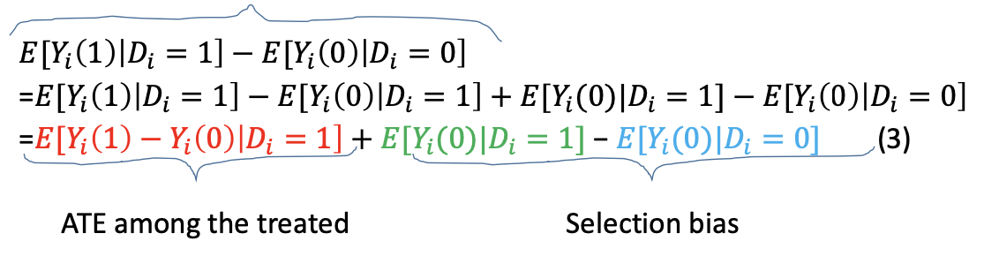

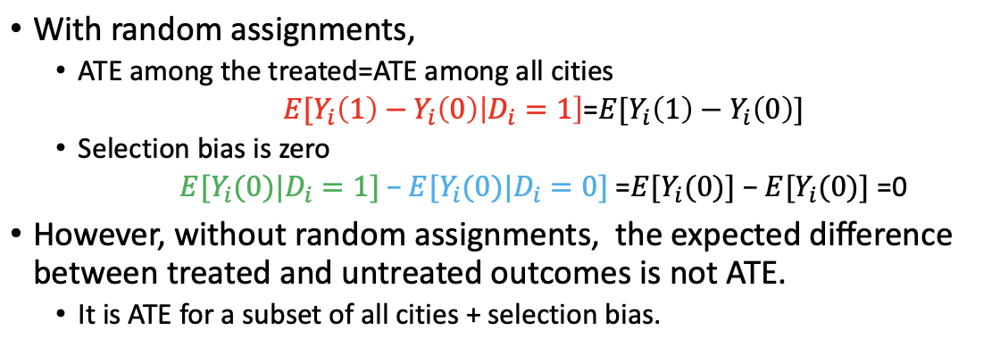

Summary: Value of Experiments

- Experiments generate unbiased estimate of the ATE regardless whether the data scientist accounts for the other causes of outcome.
- Randomly assigned treatments are independent of all observed and unobserved variables.
  - Any correlation between the treatment and other factors that affect outcomes arises by chance.
- With **randomized** experiments, it’s not necessary to control for other variables that affect outcomes for an unbiased estimate for the ATE. 
  - **Simply compare the average of the treatment group and the control group would give us the causal effect of the treatment**

## Brand Search Ads Experiment

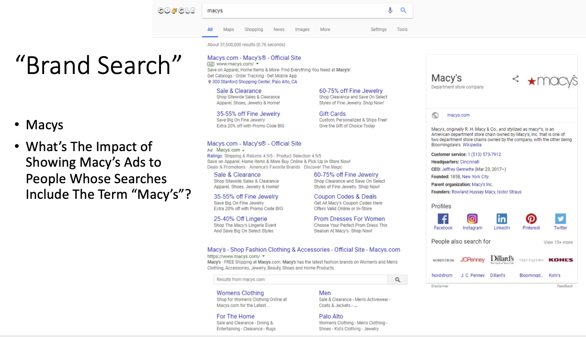

Brand search: Search of the brand name on internet

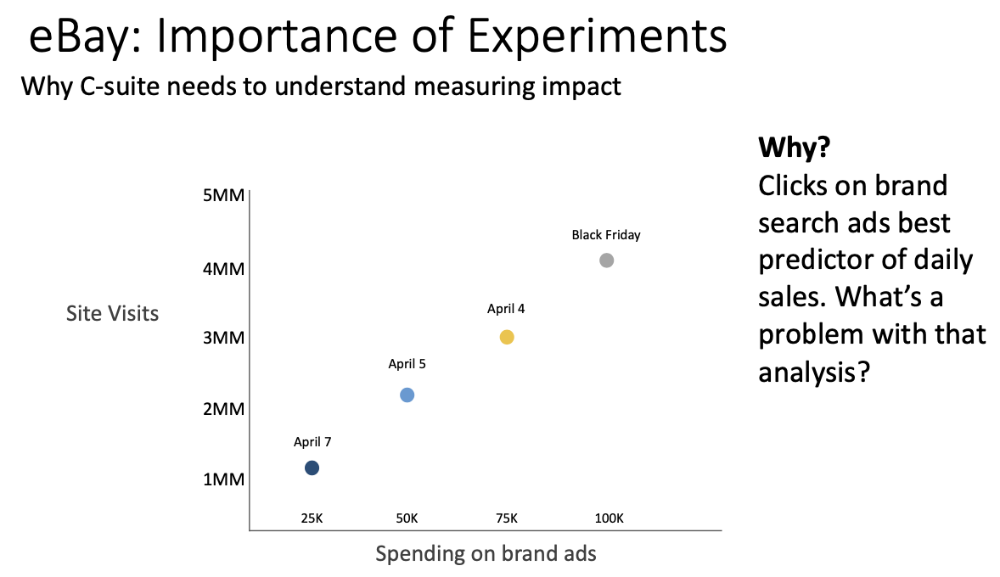

Problem: Data point come from different times. 

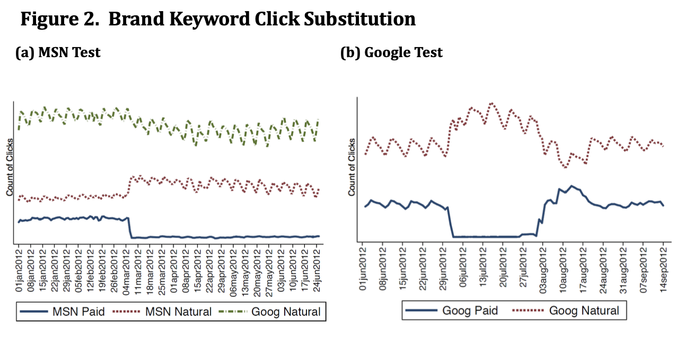

- Stop the easiest path to ebay, simply direct these customers to the next easiest path (natural search)

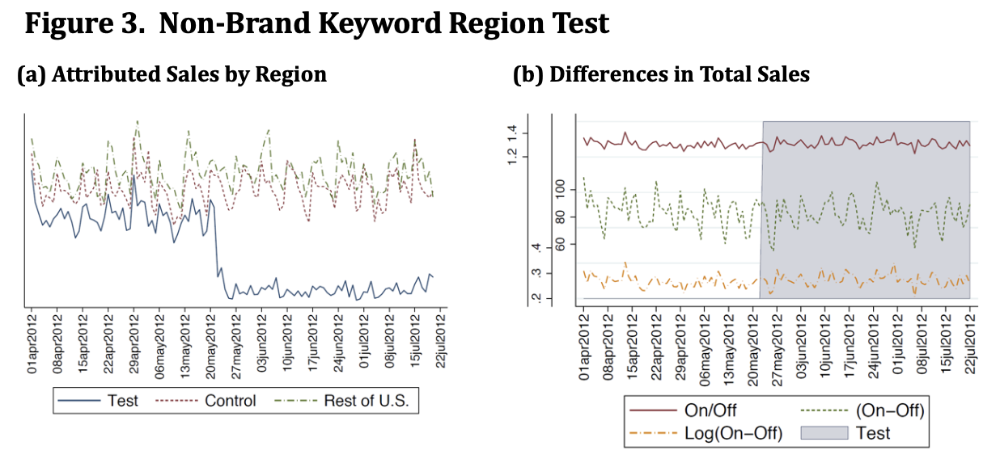

- Left only included attributed sales; what eBay wants is attributed sales+organic sales

- The decreased attributed sales is totally compensated by the increasing organic sales

  

### Wrong ways how others measure ads

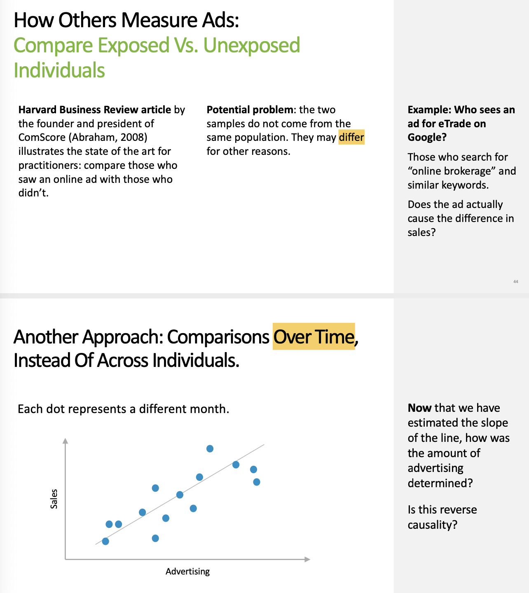

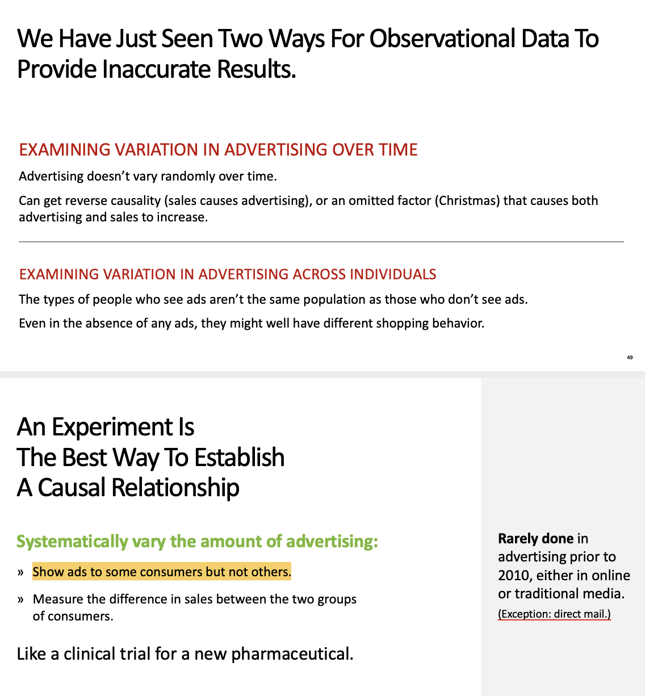

## Lab

### Project 1: QuikMart vs. FastMart

> **Should** **we rename all QwikMarts to FastMarts?**

|                       **QwikMart**                       |                        **FastMart**                        |
| :------------------------------------------------------: | :--------------------------------------------------------: |
| $1 million annual revenue on average  <br />7,911 stores | $1.1 million annual revenue on average  <br />2,089 stores |

Randomly assign some of the stores as QwikMart and some as FastMart

However, in reality, store owners will assign the name as they want. 

```R
mean(replicate(100000,mean(sample(sales.iffastmart,2000))))
```

> By calculating and repeating the sampling 100000 times, we could get the average of these means and be close to the true average. 
>
> USING **REPLICATE**(100000, xxx) in R

### Project 2: Charitable giving example