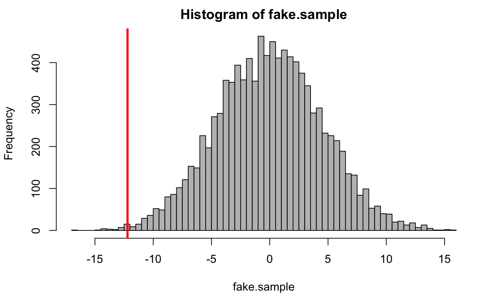
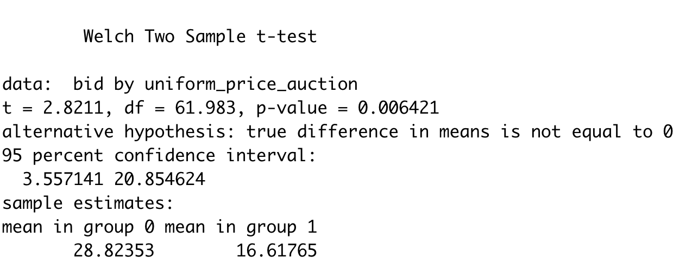

> Name: Yuki Ao
>
> Student ID: 474878

1. (a) Two potential outcomes are: 1) if child 2 did play outside more than 10 hours a week, his visual acuity would become 0.1; 2) if child 2 did not play outside more than 10 hours a week, his visual acuity would become 0.6.

   (b) Because of the treatment is playing outside more than 10 hours, the treatment effect should be $PO(did\ play)-PO(did\ not\ play)$ . The results should be:

   |          | Individual treatment effect |
   | :------: | :-------------------------: |
   | Child 1  |              0              |
   | Child 2  |            -0.5             |
   | Child 3  |              0              |
   | Child 4  |              0              |
   | Child 5  |             0.9             |
   | Child 6  |              0              |
   | Child 7  |              0              |
   | Child 8  |              0              |
   | Child 9  |              0              |
   | Child 10 |              0              |

   (c) $ATE=\frac{1}{10}\sum_{i=1}^{10}\tau_i=(-0.5+0.9)/10=0.04$ 

   (d) The new treatment is in the following table:

   |          | Treatment or not | PO (did) | PO (not) |
   | :------: | :--------------: | :------: | :------: |
   | Child 1  |        Y         |   1.1    |          |
   | Child 2  |        N         |          |   0.6    |
   | Child 3  |        Y         |   0.5    |          |
   | Child 4  |        N         |          |   0.9    |
   | Child 5  |        Y         |   1.6    |          |
   | Child 6  |        N         |          |   2.0    |
   | Child 7  |        Y         |   1.2    |          |
   | Child 8  |        N         |          |   0.7    |
   | Child 9  |        Y         |   1.0    |          |
   | Child 10 |        N         |          |   1.1    |

   There are only 5 treatment groups. So the new ATE should be:

   $ATE\\=E[Y_i(1)|D_i=1]-E[Y_i(0)|D_i=0]\\=(1.1+0.5+1.6+1.2+1)/5-(0.6+0.9+2+0.7+1.1)/5\\=1.08-1.06\\=0.02$  

   (e) The estimates from (d) is only slightly different from (c), so the reason may be simply due to random chance. 

   (f) The new treatment is in the following table:

   |          | Treatment or not | PO (did) | PO (not) |
   | :------: | :--------------: | :------: | :------: |
   | Child 1  |        Y         |   1.1    |          |
   | Child 2  |        Y         |   0.1    |          |
   | Child 3  |        Y         |   0.5    |          |
   | Child 4  |        Y         |   0.9    |          |
   | Child 5  |        Y         |   1.6    |          |
   | Child 6  |        N         |          |   2.0    |
   | Child 7  |        N         |          |   1.2    |
   | Child 8  |        N         |          |   0.7    |
   | Child 9  |        N         |          |   1.0    |
   | Child 10 |        N         |          |   1.1    |

   $ATE\\=E[Y_i(1)|D_i=1]-E[Y_i(0)|D_i=0]\\=(1.1+0.1+0.5+0.9+1.6)/5-(2.0+1.2+0.7+1.0+1.1)/5\\=-0.36$ 

   (g) The ATE of (f) is far less than (c), even with opposite impact.  The result of (f) shows that playing more than 10 hours outside will negatively affect the visual acuity of child, while the result of (c) shows that playing more than 10 hours will positively affect. There may be omitted variable bias in play, for example, the ages of these children are different, or the visual acuities of their parents are different, causing child 6-10 with better visual acuity in the first place. 

2. First of all, the number of samples (N) for women is far smaller than men so the sampling for women may not be representative and random as men, which results in being statistically insignificant. In result, there may also be omitted variables in play that weren't mentioned, for example, the chosen women may be biased, which results in the \$6 standard error. 

3. (a) When breaking even, 

   $prob*profit=cost\\profit=100\\cost=0.1$ 

   So $prob=0.001=0.1\%$ 

   The ad campaign needs to increase the probability of purchase by 0.1%. 

   (b) $ROI=(0.4\%*100-0.1)/0.1=3=300\%$ 

   (c) 

   ```{r}
   ATE <- 0.4
   treat_prob <- 0.009
   control_prob <- 0.005
   treat_n <- 1000000/2
   control_n <- 1000000/2
   
   treat_x <- treat_prob*treat_n
   control_x <- control_prob*control_n
   
   p <- (treat_x+control_x)/(treat_n+control_n)
   SE <- sqrt(p*(1-p)*(1/treat_n+1/control_n))
   
   CI_95 <- 1.96*SE*2
   print(CI_95)
   ## 0.0006536416
   ```

   The length of the confidence interval is 0.06536416 percentage point, which is between 0.367 percentage point and 0.433 percentage point. 

   (d) 

   ```R
   print(treat_prob-control_prob-CI_95/2) #0.003673179
   print(treat_prob-control_prob+CI_95/2) #0.004326821
   ((treat_prob-control_prob-CI_95/2)*100-0.1)/0.1 #2.673179
   ((treat_prob-control_prob+CI_95/2)*100-0.1)/0.1 #3.326821
   ```

   We can be 95% confident that between 0.367 percentage point and 0.433 percentage point more probability of purchase for the people exposed to iPhone ads than those not exposed, which means in ROI terms we can be 95% confident that if running ads ROI could be between 267.3% and 332.7% more than not running ads. 

   (e) I think the length of the 95% confidence interval is 0.065, which is quite narrow, so the confidence interval is precise enough to run the experiment. 

   (f) 

   ```R
   ATE <- 0.4
   treat_prob <- 0.009
   control_prob <- 0.005
   treat_n <- 1000000*(1-0.002)
   control_n <- 1000000*0.002
   
   treat_x <- treat_prob*treat_n
   control_x <- control_prob*control_n
   
   p <- (treat_x+control_x)/(treat_n+control_n)
   SE <- sqrt(p*(1-p)*(1/treat_n+1/control_n))
   
   CI_95 <- 1.96*SE*2
   print(0.005-CI_95/2) #0.0008586443
   
   ((treat_prob-control_prob-CI_95/2)*100-0.1)/0.1 #-1.141356
   ((treat_prob-control_prob+CI_95/2)*100-0.1)/0.1 #7.141356
   ```

   In this case, we can be 95% confident that if running ads ROI could be between -114.1% and 714.1% more than not running ads. However, the confidence interval is too wide, so I wouldn't recommend running this experiment. 

4. (a) 

   ```R
   estimated.ate <- mean(bid[which(uniform_price_auction==1)])-mean(bid[which(uniform_price_auction==0)])
   print(estimated.ate) #-12.20588
   ```

   The ATE of using a multi-unit auction on bids is -12.20588, which means the bids will be 12.20588 lower than bids by Vickrey. 

   (b) 

   ```R
   rand.est.ate <- function(){
     fake.treatment <- sample(uniform_price_auction)
     return (mean(bid[which(fake.treatment==1)])-mean(bid[which(fake.treatment==0)]))
   }
   fake.sample <- replicate(10000,rand.est.ate())
   hist(fake.sample,breaks=100,col="grey")
   abline(v=estimated.ate,lwd=3,col="red")
   ```

   

(c) 

```R
mean(fake.sample<=estimated.ate)
```

The p-value is 0.0033. 

(d) The p-value means the probability we would have gotten a value that low under the null hypothesis. The p-value in this case is smaller than 0.05, which means it's highly impossible for the null hypothesis to be true. So we could reject the null hypothesis and conclude multi-unit auction will lower bids than Vickrey. 

(e) After running t.test in R, the results are in the following:

```R
t.test(bid~uniform_price_auction)
```



The 95% confidence interval of the difference in means of two groups is between 3.557141 and 20.854624. 

(f) It means that we could be 95% confident that the bids using multi-unit would be between -20.854624 and -3.557141 lower than Vickrey. 

