## 4.1 Sampling Distributions: Where Statistical Uncertainty Comes From

### Sampling Distribution

Distribution of effect estimates we might reach by chance

- Data: *one of many* possible datasets that could have been generated through random assignment.
  - In reality, only 1 was realized (2,5)
    - 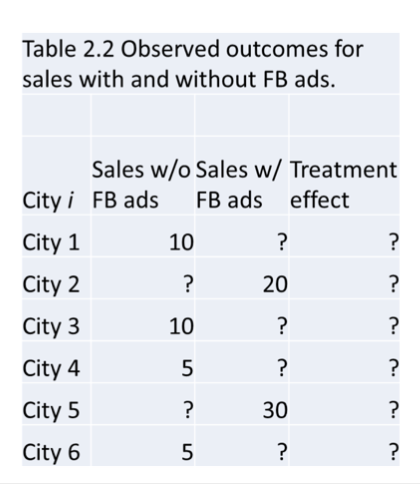
  - Therefore, the estimated ATE from our experiment is just *one* estimate out of many possible estimates.
- Table 2.1.1: hypothetical estimated ATEs for all random assignments.
- The average in 2nd column is 5, which is the true ATE.
- But, large variations in the estimate from each random assignment.
- **“*Sampling distribution*”** refers to the collection of estimates that could have been generated by every possible random assignment.

## 4.2 Simulating Sample Distributions in R

### Setting

- We want to estimate the impact of standing on a stool on height.
- Treatment: Standing on a stool
- Outcome: Height
- Of course, the logic applies to other treatments and outcomes.

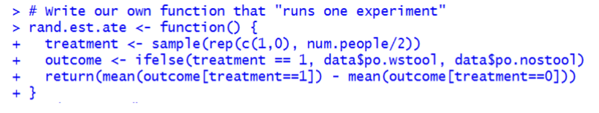

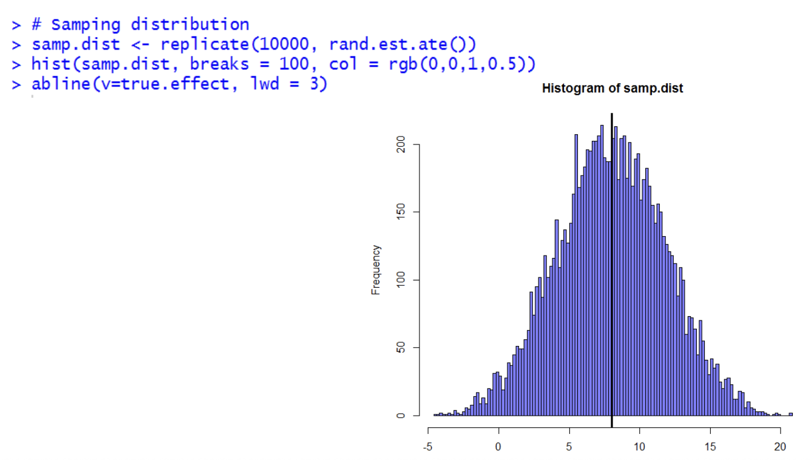

## 4.3 Trying to Convince a Skeptic: Hypothesis Testing

To prove by contradiction: assume the opposite

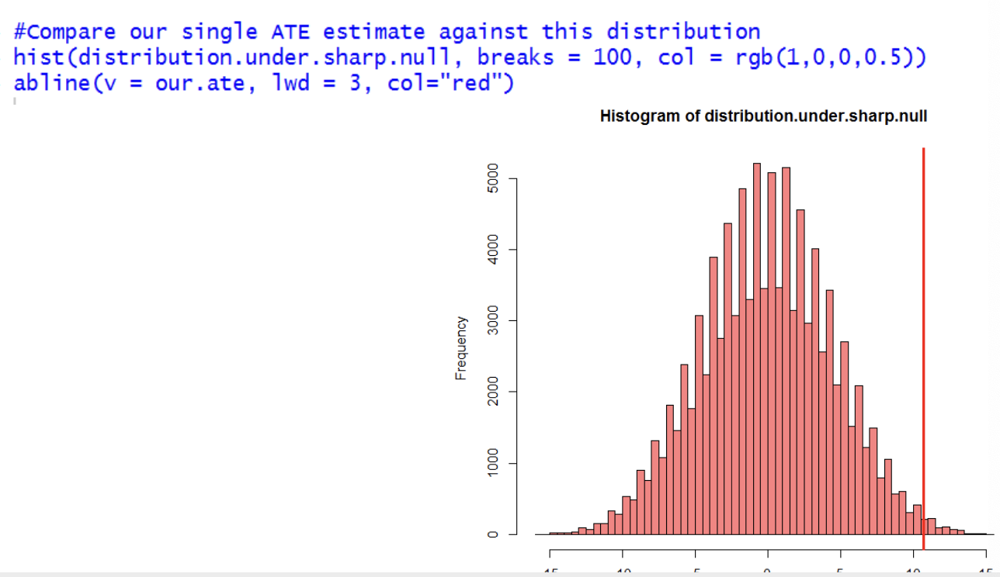

> It's quite impossible to see our estimate to happen (abline) when the null hypothesis is true and the true estimate is 0 (distributed around 0)

What possibility? (P-value)

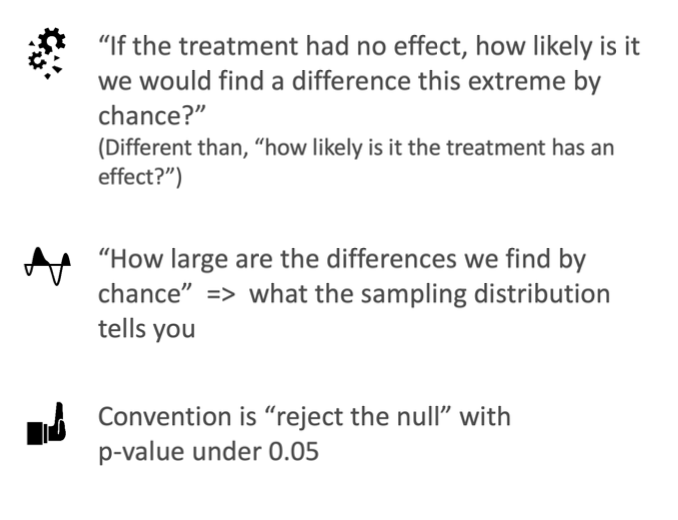

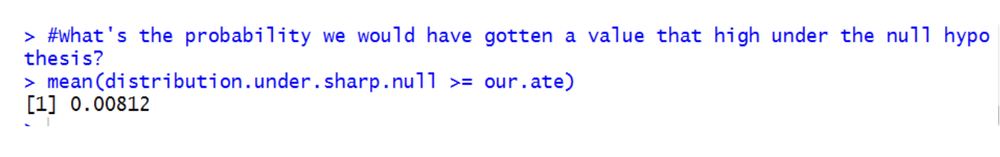

> One tail p-value and a one tail hypothesis testing. (Mostly used case is two-tail)
>
> It's highly unlikely to observe our estimate.

## 4.4 Statistical Power

As We Have Seen, <u>ATE Estimates In Particular Experiments Are Random</u>

Random enough that, under some conditions, we can get insignificant *p*-values even if the true ATE is not zero

Possible the treatment had some effect, but that an effect that size also could have arisen by chance

Raises The Problem Of Statistical Power

In planning experiments, important to consider how large of an effect you want to reliably detect

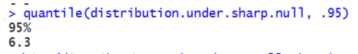

Have to more than 6.3 in order to reject the null hypothesis

## 4.5 What Leads to More Statistical Power?

### POWER INCREASES WITH

- Size of effect
- Square root of sample size
- Variation in treatment
  - *Importance of “concentrated tests*

### POWER DECREASES WITH

- Variation in outcome (larger differences will happen by chance)

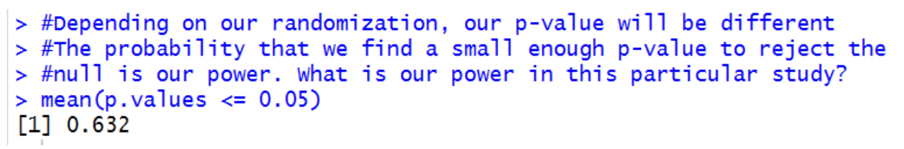

There's 63.2% chance that we'll find a p-value that's small enough to reject the null hypothesis

#### Increase power

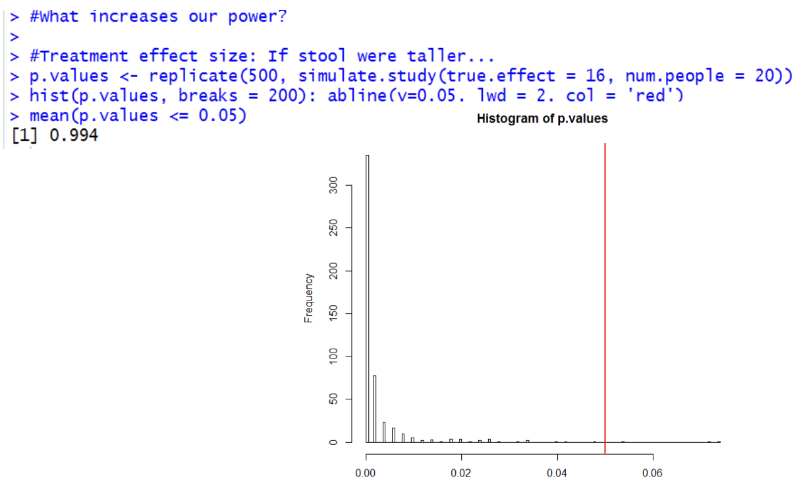

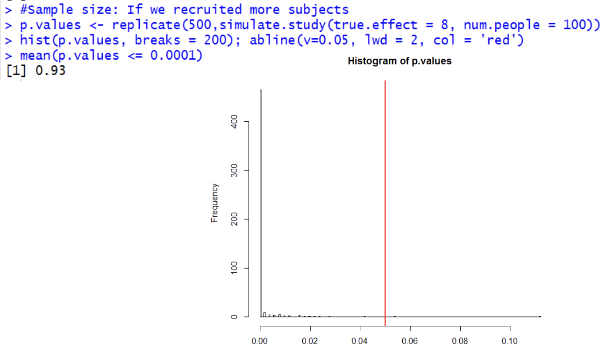

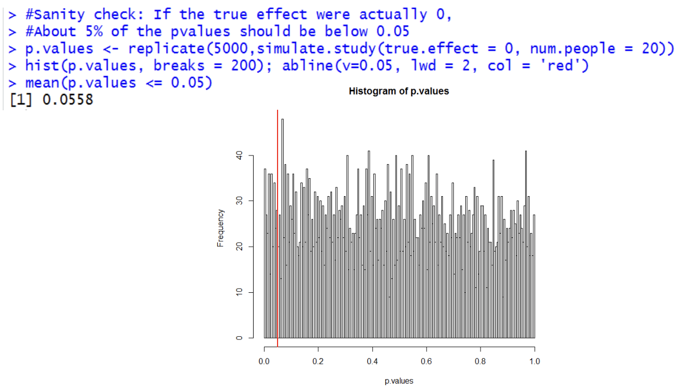

## 4.6 Standard Errors and Confidence Intervals

### Standard Error 

 Standard Deviation Of The Sampling Distribution

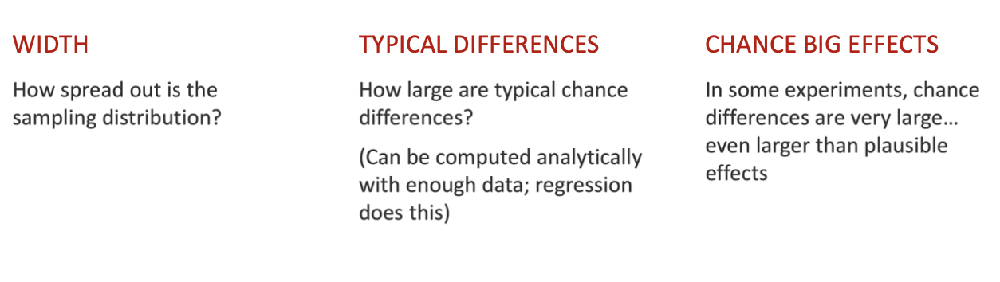

### Confidence Intervals 

Tell Us How Precisely Effect Is Estimated In More Intuitive Terms

“Is there any effect?” or “Is the effect larger than X?” often not what we care about

**Confidence interval: “95% chance the true effect will fall in this range”**

#### 68% of the ATE estimates fall into one standard error

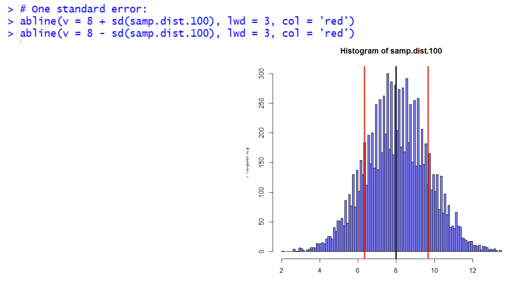

#### 95% of the ATE estimates

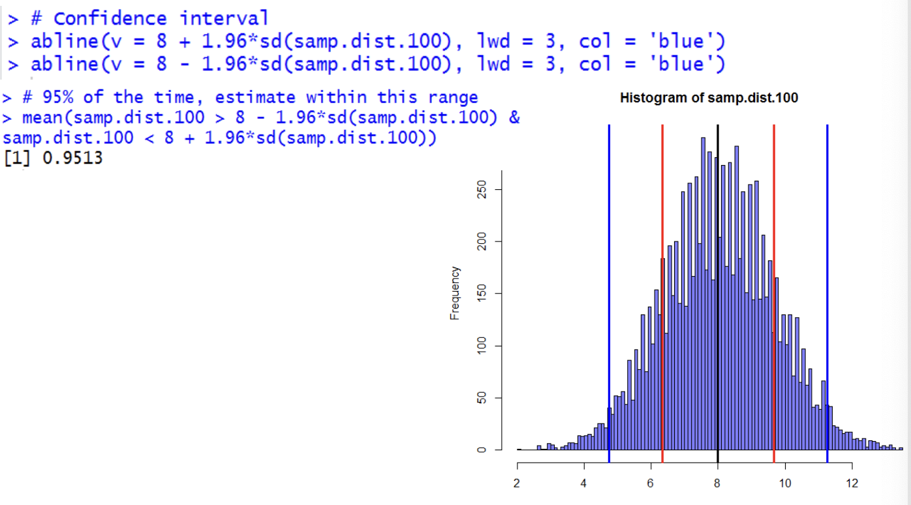

#### Obtaining A Confidence Interval From Regression

**Can obtain using regression: estimate +/- 1.96 \* standard error**

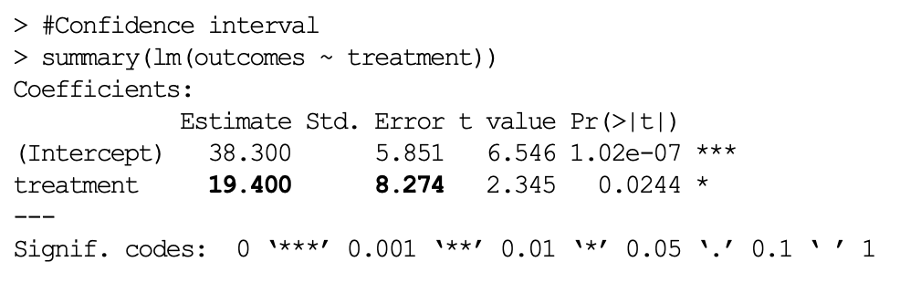

## Summary 

1. **A sampling distribution** under the null is the distribution of estimates we would receive by chance were there no effect.
2. p-value tells us **how likely we are to get estimates as large as the estimate we got by chance.**

3. **p-values** tell us Probability (estimate <u>given we’re **wrong**</u>), not Probability(we’re right given the data).
4. **p-values** can often reflect statistical power or precision, which increases when effects and sample sizes are larger.

5. **Confidence intervals** represent our uncertainty around the size of an effect. Our “best guess” is the estimate.