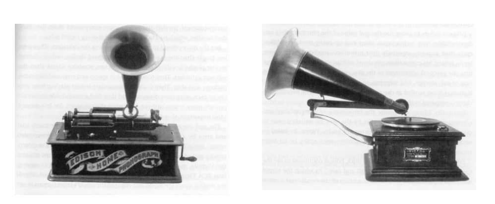

### 1.1 Predictable Irrationality: The Essence of Good Marketing

- Marketing 101 is about understanding the customer needs; not defining what the product is meant to do using your own thinking hat but instead learning from consumers what use they could potentially find for a technology that you have invented. 
  - Customers don't want to record their own voice and playback to friends but playback to music. 
  - Phonograph vs. gramophone player: gramophone wins
    - Does it mean it's better? No, the gramophone decreases the rotation when the needle reads the music, so the best song of the album is at the outer ring however the phonograph is good for fidelity
    - Cylinders of the phonograph stock has to take up more space and hard to handling; disk can be stored in both sides, have twice the music stored

### 1.2 Course Logistics

#### Descriptive Purpose

- Data analysis entails being scientific and rational.
- Data analysis does not warrant the assumption that what is being modeled is scientific and rational
- Consumers may be “irrational” but “predictable”!

#### Data-Driven Brand Management

- <u>Descriptive</u> purpose: Quantify market’s reactions to brands’ marketing mix (4P’s). MKT 555A
- <u>Prescriptive</u> purpose: Optimally set brands’ marketing mix. MKT 555
- 2018 Advertising Spending in US: (eMarketer)

#### Blueprint for Course

- Forecast “primary demand” for industry. • Identify market structure.
- Apply marketing mix models.
- Estimate “secondary demand” for brand.

### 1.3 Introducing the Bass Model

#### Understanding The Future Of Primary Demand

#### The Bass Model for New Produc098 Diffusion

- *M* : Market size, the eventual total number of adopters

- *N* (*t*): \# of **new** adopters in period (e.g., quarter) *t*

- *A*(*t-1*): \# of customers who have **already** adopted until period (e.g., quarter) *t-1*

- *R*(*t*): \# of **remaining** customers who can **potentially** adopt in period (e.g., quarter) *t* 

- *p*: Coefficient of **innovation** 

  - external communication channel such as advertising
  - Marketers can influence p using advertising 
  - Can also be called as coefficient of **external influence**

- *q*: Coefficient of **imitation / word-of-mouth** 

  - Internal communication which is between consumers themselves, or word of mouth 
  - Marketers cannot influence that; can only respond to 
  - Can also be called as coefficient of **internal influence** 

  > Usually p is typically small, q is typically large
  >
  > - The number of people who queue outside an apple store when the new model hits only are small size of the market. The rest of us wait and watch. Q is typically the dominant force in the market 

- Sum all new adopters in all periods = already adopted
- **The 3rd represents the bass model:** (usable version)
  - $H(t) = \frac{N(t)}{R(t)}$ = Left side =  the fraction of the remaining customers who will adopt in a given period 
    - H: hazard; because the model was used in epidemiology to study how diseases spread. So this can be think of as representing among the remaining susceptible people in the population. How many new people are going to be infected in a given period? 
  - Right side fraction (A/M) = the fraction of all adopters that has already adopted
  - Linear equation, an intercept (p) and a slope (q)
  - The fraction of the remaining adopters who will adopt in a given period is a linear function of the fraction of all adopters that has already adopted.
- **The 4th represents the bass model version 2**

#### Generating the Sales Series from p, q, M

1. Period 1 values as follows:

   $A(0)=0$

   $R(1)=M$

   $H(1)=p$

   $N(1)=pM$

2. For every subsequent period, starting with t=2:

   $A(t-1)=N(t-1)+A(t-2)$

   $R(t)=M-A(t-1)$

   $H(t)=p+q\frac{A(t-1)}{M}$

   $N(t)=H(t)*R(t)$

3. $N(1)=pM$ 

4. $N(2)=pM(1+q)(1-p)$ 

   1. The second period adopters are imitating the first period adopters.
   2. Recursive model

5. What would the Sales Series look like for $M=100,p=0.02,q=0.4$? 

   

   - Left picture represents the <u>**current**</u> adopters. N(t)
     -  **Bass Model Bell-shaped Curve**: There's a peak in some period of time and in the end no subsequent need for this product. All product will go through a **lifecycle**. 
   - Right picture represents the **<u>cumulative</u>** adopters. A(t) $A(t-1)=N(t-1)+A(t-2)$ 
     - **S-Shaped Curve**: Cumulative adoption curve. Eventually plateau. It's the market potential. Every one that's potentially adopted is adopted and the cumulative adoption stays at 100. 
   - Once everybody has adopted, there's no more new adopters to have, so this has fallen to 0. As left hand picture falls to 0, the right hand picture plateaus at 100. 
   - **PLC**: Product lifecycle hypothesizes that sales of a new product go through four stages: **launch, growth, maturity and decline** 
   - Both y-axis represent how many people (**number of customers**) have adopted your new product; it does not represent unit sales / dollar sales. 
     - But special case: for a highly durable product such as washing machine, one customer only buys one product in a given period, the bass model forecasts unit sales. 

----------------

- The middle one: bell-shaped; s-shaped

- The last one (smaller p, larger q): more pronounced in the shape; sales peak / adoption peaks much more and much further to the right than before

- The top one (not typical): diminishing curve, the shape is gone

  > **Think of a product like this. Most of the products happen in the beginning of launch and then it's progressively decays.** 
  >
  > Products like phonograph. Only innovative customers but s
  >
  > Hard-to-share drugs 
  >
  > **Movies** innovation one-of-a-kind

- As p increases, early adoption will increase. 

- Q reflects the strength and speed of continued adoptions beyond that initial adoption. High q means the new product is getting into the rest of the market very quickly. Low q means the new product is diffusing relatively slowly throughout the rest of the market, or among non innovators. 

- P tends to be 0.04 (wider range but usually one magnitude smaller than q), q tends to be about 0.3 (0.2-0.5) (middle picture is the average new product); ratio of p/q ≈1-10

#### Timing and Volume of <u>Peak Sales</u>

1. Calculate the sales, draw the bass model curve

2. Using the **classic formula** 

   

   

### 1.4 Applying the Bass Model 

#### Predicting Future Sales from Past Sales

Can only make forecasts 1,2, or 3 years from now

Need 4 column dataset (time; new adopters (N); cumulative adopters (A); cumulative adopters squared ($A^2$))

#### How to Estimate p, q, M?

**Four steps**: 

1. Get N(t), A(t-1), $A^2(t-1)$ 
2. Run a regression: get a, b, c
3. Solve for p, q, M using the values of a, b, c
4. Predict 

Run a <u>linear regression</u> model (Excel data analysis)

### 1.5 Robustness of the Bass Model

#### How accurate and steady of the bass model?

Market size M is highly unreliable. If introduce a little bit of noise in the data, our answers get way off. 

> Q: If both are correct, why is the forecast so stable in this case not the previous case? What does it mean to a manager from the standpoint of using the bass model to forecast future adoptions?
>
> A: In one case, it's far away from the peak, waiting to grow up just to going up, it will be highly unreliable. 

Buy pack

Sign up for account

### Lab

- 3 steps to calculate p, q, M
- 4 steps to forecast A(t-1), R(t), H(t), N(t)

