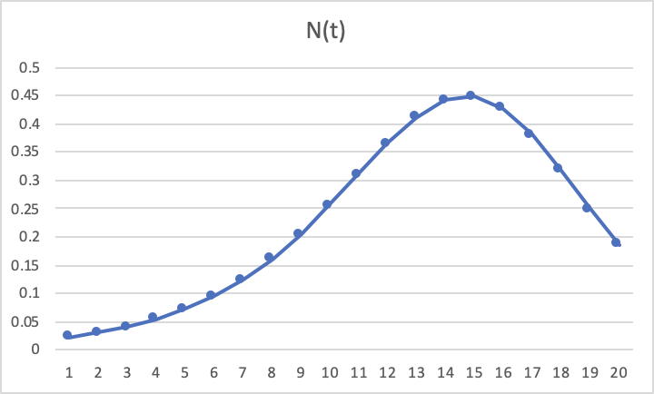
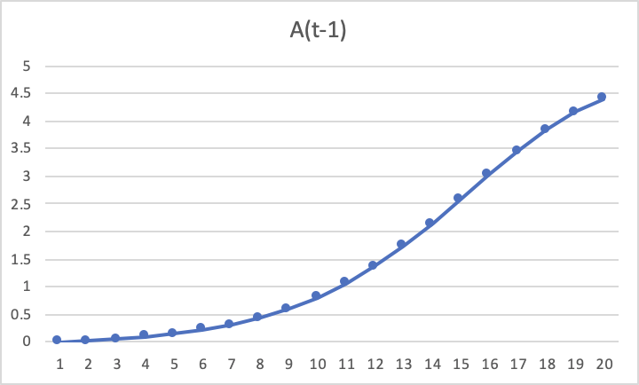

1. Suppose the Bass Model parameters for a new product are p = 0.0045, q = 0.35, M = 5m.

   1. Plot adoptions, N (t), as a function of time for this new product.

      

   2. Plot cumulative adoptions, A (t‐1), as a function of time for this new product.

      

   3. What is the expected peak time of adoption for this new product?

      **t=15.** 

   4. How many adoptions will occur for this new product during its peak time of adoption?

      **Around 0.45 million adoptions.** 

2. Suppose the observed numbers of adoptions (in millions) for a durable good during the first 5 years of its life thus far were 0.517, 1.169, 1.604, 2.044 and 2.286.

   1. How many adopters are expected to adopt this product over its entire lifetime? (Hint: Use the linear regression procedure to estimate the Bass model parameters, as discussed in class; the estimated value of M is the answer to this question)

      | Time (t) | Adoptions (N(t)) | A(t-1) | A(t-1)^2  |
      | -------- | ---------------- | ------ | --------- |
      | 1        | 0.517            | 0      | 0         |
      | 2        | 1.169            | 0.517  | 0.267289  |
      | 3        | 1.604            | 1.686  | 2.842596  |
      | 4        | 2.044            | 3.29   | 10.8241   |
      | 5        | 2.286            | 5.334  | 28.451556 |

      After running regression and getting a, b, c, we'll get data in the following:

      | p         | q          | M          |
      | --------- | ---------- | ---------- |
      | 0.0626032 | 0.73766359 | 10.5036768 |

      **About 10.5 million adopters are expected to adopt.**  

   2. Forecast the number of adoptions of this new product in each of the next 3 years. (Hint: Use the recursive technique to forecast adoptions, as discussed in class)

      | Time (t) | Adoptions (N(t)) |
      | -------- | ---------------- |
      | 6        | 1.723714402      |
      | 7        | 0.833785284      |
      | 8        | 0.253556965      |

   

