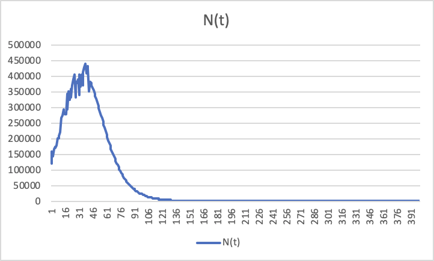
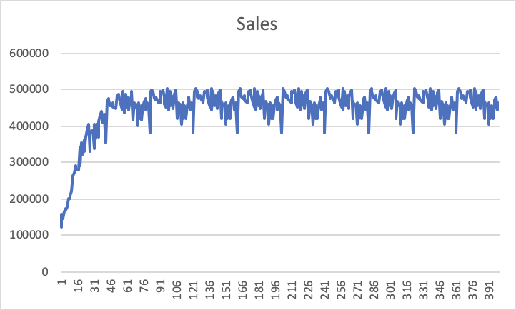

> **Name: Yuki Ao / 474878**

## Individual Assignment 1

1. US Adoptions data for SUVs from their quarter of launch are given in “2‐SUV‐ CategoryLevelDiffusionData.csv” attached herewith.

   1. Estimate the Bass Model (BM) for SUV adoption using the linear regression technique discussed in class (i.e., do not use Number Analytics software). Report the estimated values of p, q and M. Explain the meanings of the 3 coefficients.

      **Using linear regression, we could get intercepts and coefficients in the following:**

      |           | Coefficients |
      | --------- | ------------ |
      | Intercept | 144698.699   |
      | A(t-1)    | 0.05252349   |
      | A^2(t-1)  | -2.629E-09   |

      **And then calculate:** 

      | p    | 0.00645005 |
      | ---- | ---------- |
      | q    | 0.05897355 |
      | M    | 22433724.1 |

      **Coefficient p is coefficient of innovation, meaning how much influence over potential adopters through external communication channel such as advertising. Coefficient q is coefficient of imitation or word-of-mouth, which is the level of influence through internal communication which is between consumers themselves. M is the market size, in this case, the eventual total number of adopters for SUV is 22433724.** 

   2. Forecast the number of predicted adoptions for SUVs from quarter 43 to quarter 400. Report these forecasted adoptions in the form of a plot, where the predicted adoptions are on the y‐axis and time (in quarters, from quarter 1 to quarter 400) is on the x‐axis (Hint: In the above plot, for the first 42 quarters, simply use the actual adoptions in the data for the y‐values; use forecasted adoptions as the y‐values from quarter 43 onward).

      

2. Suppose consumers repeat‐purchase SUVs every 11 years. In other words, SUV adopters from quarter 1 will repeat purchase an SUV for the first time in quarter 41 (i.e., 10 years after adoption), and then repeat purchase an SUV for the second time in quarter 81 (i.e., 20 years after adoption) etc. Under this repeat‐purchase assumption, forecast the predicted sales for SUVs from quarter 43 to quarter 400 (Hint: Predicted Sales in a given quarter = Adopters + First‐ time Repeat Purchasers + Second‐time Repeat‐Purchasers etc.). Report these forecasted sales in the form of a plot, where the predicted sales are on the y‐axis and time (in quarters, from quarter 1 to quarter 400) is on the x‐axis. (Hint: In this plot, for the first 42 quarters, simply use the actual adoptions in the data for the y‐values; use forecasted sales as the y‐values from quarter 43 onward).

   **Because of the repeat customers in Year 41 and 42, sales in those two years don't mean the same as N(t), which means the new table should be like in the following:** 

   | t    | N(t)   | A(t-1)   | A^2(t-1)   | H(t)       | Sales  |
   | ---- | ------ | -------- | ---------- | ---------- | ------ |
   | 39   | 408572 | 11404453 | 1.3006E+14 | 0.04992519 | 408572 |
   | 40   | 431491 | 11813025 | 1.3955E+14 | 0.05145811 | 431491 |
   | 41   | 301121 | 12244516 | 1.4993E+14 | 0.05307702 | 422275 |
   | 42   | 194382 | 12545637 | 1.5739E+14 | 0.0542068  | 352022 |

   **So p, q, and M should be re-calculated:** 

   | p    | 0.00713681 |
   | ---- | ---------- |
   | q    | 0.06978122 |
   | M    | 18598894.3 |

   **And according to the new parameters, we could forecast N(t) in the next tens of years. And sales need to be treated differently since every ten years previous customers would be back, for example, Sales(121)=N(1)+N(41)+N(81), etc. Eventually, we would get a plot with repeat trends every 10 years in the following:** 

   

The eventual constant sales is round M/40. 

If there's no repeat customers, the eventual sales is 0. 