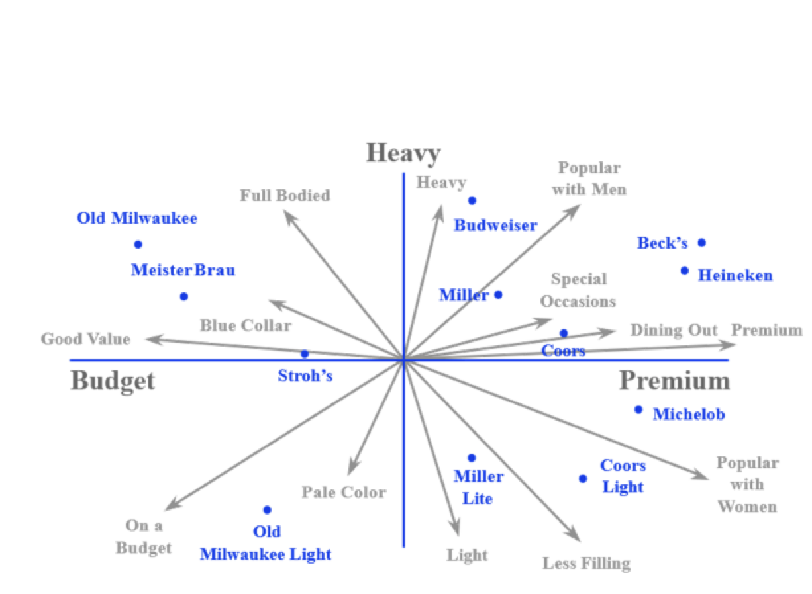

## Identifying Competitor Set

- Explicit Response Questionnaires
  - Aided Recall
    - in the aided recall task, the response choices are explicitly pre-specified in the survey. So the respondent simply **checks** all the answers that apply to him or her. 
  - Unaided Recall
- <u>Implicit Response Questionnaires</u> 
  - **Perceptual Map** 
- Behavioral Data

### Examples of perceptual map

- 2 axis
  - How to interpret the labels
    - Subjective judgement
    - Need to keep rotating 
    - Can run AR surveys to determine the attributes but very costly
- Arrows: indicate different attributes, different lengths, different directions, more information (more commonly used by marketers)
- Project on the attribute vector; which is **farther** out on the direction, then it's more in terms of the attribute

##### Consumer Conceptions of the directions of the attributes

- If Consumers view the attributes opposite (vectors of <u>opposite direction</u>), then when marketing and positioning, you can only target one attribute and never say you're also the other; either this or that
- We could re-position the brand and move further out on those two attributes at the same time if the vectors are <u>vertical</u> to each other. 
- When vectors are almost at the <u>same direction</u>, we don't need to target all those 3 things because of loss of extra money. Consumers view those few attributes as the same things. We could cut off the budget to only 2-3 remaining positions. 
  - 

## Perceptual Mapping Techniques

1. Overall Similarity (OS) Approach

2. Attribute Ratings (AR) Approach

## Overall Similarity (OS) Approach

- Overall (dis)similarity assessments
- Technique: Metric Multidimensional Scaling (**MDS**)

----------

- No attribute set is presented. (Not actionable; which to improve)
- Typical respondent automatically focuses on just the attributes that are relevant to him / her.
- We get a map, but there is no way to interpret which direction means what.
- Should pairs be rated on **dissimilarity** or similarity?
  - Dissimilarity is easier to answer 
  - Tourist destinations: similarity easier

#### Dissimilarity Ratings Collected in OS Approach

|              | Chicago | Wharton | Harvard | Cornell | Stanford | Northwestern | Dartmouth | Columbia | MIT Sloan |
| ------------ | ------- | ------- | ------- | ------- | -------- | ------------ | --------- | -------- | --------- |
| Chicago      | *×*     | *×*     | *×*     | *×*     | *×*      | *×*          | *×*       | *×*      | *×*       |
| Wharton      | 3       | *×*     | *×*     | *×*     | *×*      | *×*          | *×*       | *×*      | *×*       |
| Harvard      | 9       | 6       | *×*     | *×*     | *×*      | *×*          | *×*       | *×*      | *×*       |
| Cornell      | 10      | 10      | 9       | *×*     | *×*      | *×*          | *×*       | *×*      | *×*       |
| Stanford     | 3       | 0       | 6       | 10      | *×*      | *×*          | *×*       | *×*      | *×*       |
| Northwestern | 5       | 3       | 4       | 7       | 3        | *×*          | *×*       | *×*      | *×*       |
| Dartmouth    | 7       | 7       | 7       | 3       | 7        | 4            | *×*       | *×*      | *×*       |
| Columbia     | 8       | 8       | 8       | 2       | 8        | 5            | 1         | *×*      | *×*       |
| MIT  Sloan   | 0       | 2       | 8       | 9       | 3        | 4            | 6         | 7        | *×*       |

The right part is the same as the left part.

The numbers are the **average** among the respondents. (0-10, similar to very dissimilar)

1. Run a dissimilarity rating survey with a large sample of respondents 
2. **Average** their responses 
3. Give those average set of 36 responses to the **MDS** technique
4. Generate the OS map

#### How to interpret

- Rotate the graph doesn't change the meanings:
  - The unique identifier is relative positions
  - Who your near competitors are
    - Cornell close to Columbia and Darthout (competitors)
- x, y don't have labels; how do we figure the meanings of axis
  - Subjective interpretation: which one is better quality? which one is better value?

## Attribute Ratings Approach

- Collect ratings of various products on various attributes
- Technique: Factor Analysis (**FA**)

-------

- An attribute set is presented but it may not match the attribute set that the consumer has in mind when looking at the market’s offerings. (Actionable)
- Collecting data on an inappropriate attribute set may yield a flawed dissimilarity matrix, hence a flawed MDS and hence a flawed map.
- Given a map, understanding which **direction** means what is less arbitrary than with the Dissimilarity Approach.

### Attribute Ratings Collected in AR Approach

0-10: bad to good

|           | Managerial | Cooperative | Teaching | Prestige | Placement | Research |
| --------- | ---------- | ----------- | -------- | -------- | --------- | -------- |
| Chicago   | 1          | 5           | 1        | 3        | 5         | 10       |
| Wharton   | 7          | 3           | 7        | 8        | 8         | 7        |
| Harvard   | 10         | 1           | 10       | 10       | 10        | 1        |
| Cornell   | 3          | 5           | 4        | 3        | 4         | 5        |
| Stanford  | 5          | 7           | 5        | 8        | 9         | 8        |
| Northwes  | 8          | 10          | 9        | 6        | 7         | 4        |
| Dartmout  | 9          | 8           | 9        | 4        | 4         | 3        |
| Columbia  | 3          | 6           | 4        | 2        | 3         | 8        |
| MIT_Sloan | 1          | 3           | 4        | 7        | 7         | 10       |

### Attribute Vectors For All Attributes

- 6 attributes used in the survey, 6 vectors 
- **Long** vectors are the ones **distinguished** 
- **Length** has meanings
- **Directions** have meanings
- Interpretations questions(?)

#### What Direction and Length of an Attribute Vector Mean

- Movement along direction is correlated with increase in attribute rating.
- Projection of brand on to attribute vector indicates brand rating on that attribute.
- The length of the attribute vector represents the magnitude of correlation.
- Long attribute vectors must be used to determine axes labels.
  - No need to interpret x and y axes

## Perceptual Map of Automobiles

##### Why there's no vectors?

12 of those 24 attributes had long attribute vectors in this map and they were all pretty close to the y-axis. So they were all in this zone. So on that basis, the y-axis was called "cost of ownership" and attribute vectors were simply erased from the map because they all had some common theme or aspect pertaining to cost of ownership.

##### 4 shades of color

Based on which brands turned out to be which part of the map

Entry market - mass market (where most of the market actually lies) - luxury market - super premium market

**Whitespaces**: perhaps develop a new brand whose combination of product excellence and ownership can be constructed; no competition; 

**Survey running 5 years over a decade**: brand managers want to understand how brands change over time; which move over time and which staying put

## Empirical Findings

- OS Approach identifies the competitor set much better than the AR approach (i.e., the map itself is much more accurate with respect to who is competing with whom).
  - we are not biasing the respondent by making them respond to questions about specific attributes. We simply ask them how dissimilar a brand is to another brand. the os map is very honest, or accurate, with regard to identifying the competitor set.
- However, the AR approach’s map is more actionable, provided the attribute set is properly chosen.
  - If your purpose spans beyond that and you want to take some marketing actions to reposition your brand, then use the AR approach.
- Important Question: How do we combine the strengths of the two?
  - You could undertake a **hybrid** approach which does the following. First run an OS survey and generate an OS map. 
  - Then, run an AR survey with a second sample of respondents. Use a large number of attributes
  - Generate an AR map and see if the brand's positions relative to each other are similar in this map as in the previous OS map.
  - If not, drop some attributes from your data set and then construct another AR map, only with the remaining attributes, and see if now the brand's positions relative to each other match the positions in the OS map. 
  - Keep doing this until you are using only those attributes to construct the AR map such that the AR map and the OS map look almost identical in terms of brands' relative positions. 
  - Once you do that, since the AR map also gives you those vectors, it becomes actionable, as well.

## Brand-Switching Matrices

### Behavioral Data Approaches

- Behavioral data represent pairwise measures of substitution. These measures can be interpreted as distances and subjected to MDS.
- The key approaches are based on:
  - **Cross Price Elasticity**: Percentage reduction of sales in X when the price of Y is reduced by 1%
  - **Switching Probability**: Given that a person has bought X on one occasion, the probability of buying Y on the next occasion.
- The above are asymmetric: How do we handle that in **MDS** ?(OS approach and convert a map) 
  - MDS diagonal must be symmetric and all 0
  - Cross price elasticities:
    - Ignore the own-price elasticities and set these number to 0
    - Average the off-diagonals and write that number in the place of both numbers

### Cross Price Elasticities

- **own-price elasticity**: Diagonal numbers are all negative
- **cross price elasticity**: it represents the impact of Brand A's price on Brand B's sales; Impact of A's price on B's price; If A were to decrease its price by 1%, B's sales will decrease by 0.2% 
  - Remember this is positive, which means the price change and the sales change are in the same direction
- **Asymmetry**: One brand can impact the other more than the other brand impacts this brand
- Elasticity higher, more closer competitors
- Two average numbers for one brand (row and column):
  - Must a strong brand have a large value for this average or a small value for this average?
  - Is the answer the same for the row average as the column average?
  - How to interpret these numbers?
    - Row: how other brands' sales change when the brand's price changes
      - Higher means the brand has a strong impact in the industry
    - Column: how other brands' prices affect the brand's sales
      -  Lower means the brand is strong, it's not easy to be affected by others
-  **High row average and low column average = strong brand** 
- **Clout** !!!
  -  The ability of stealing from other brands
  -  Row average
- **Vulnerability** !!!
  -  Column average

### Switching Probabilities

- Each <u>row</u> will add up to **100%** 
  - Represents: given the certain brand that was bought last time, what is the conditional probability that a certain brand will be bought this time
- Each <u>diagonal</u> element is the largest number in its respective row
  - Represent **brand loyalties** 
- Off diagonal elements:
  - Much smaller than repeat probabilities
  - **Switching probabilities** 
    - Folgers to Maxwell: if a consumer buys Folgers at the store they have a 5% chance of buying Maxwell House the next time they buy coffee at the store.
    - The largest is the <u>closest competitions</u> 
- Two average numbers for one brand (row and column):
  - Must a strong brand have a large value for this average or a small value for this average?
  - Is the answer the same for the row average as the column average?
  - How to interpret these numbers?
    - Row: Lower the better, the more customers stay put in the brand
    - Column: higher the better, the more customers switch from other brands
- **High column average and low row average = strong brand** (opposite from elasticity matrix)
  - Row average is close to 0 and the number of A-A is close to 1
  - The column average is as close to 0 as possible. 

## Lab 

- Two-factor solution
  - Managerial / teaching on top of each other
  - Possible on 3rd dimension they are different 

Block design (how to survey a lot of questions about a lot of brands with limited budget)

Respondents will only answer a set of questions and the questions of different brands are exposed with the same probability.

> Programming solution: Marketing engineering