# Scan*Pro Model

## Inverse Demand Curve

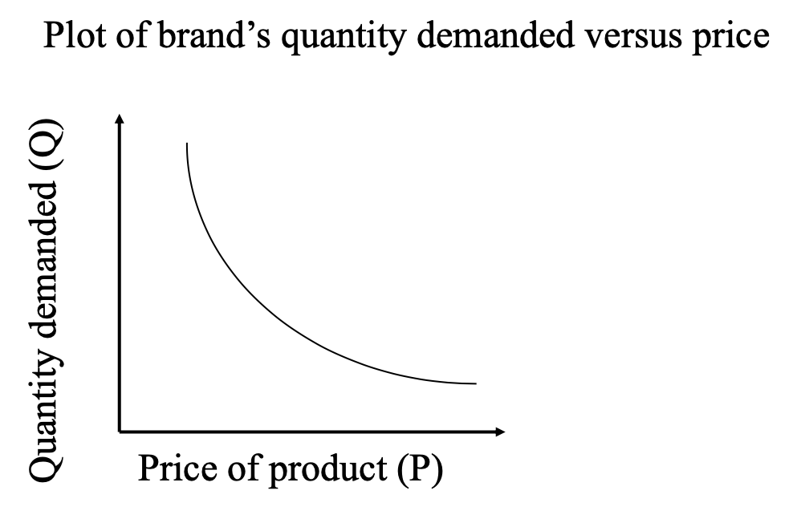

- It's a relationship between the quantity demanded of your brand versus the price of your brand. 
  - As the price decreases, the demand increases. 

- Shape: **Convex** towards the origin 

## Scan*Pro Model

1. Original Version (Wittink et al. 1988)

   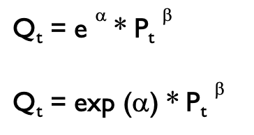

   1. The equation relates the weekly sales for your brand in week t to that week's price for your brand. 
   2. e≈2.72, constant; exp()
   3. **2 parameters: $\alpha$, $\beta$** 
      1. $\alpha$=brand **equity** of your brand
      2. $\beta$=the price **elasticity** of your brand
         1. The price of xxx decrease 1%, then the sales increase 1.15% ($\beta=-1.15$) 

2. Linearized Version: 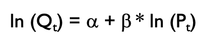 

3. These two are the same, the second one by taking logarithms off both sides of the first equation. 

### Scan*Pro Example

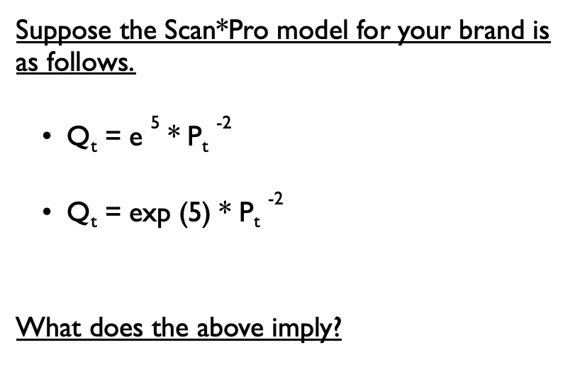

#### Brand equity $\alpha$ 

Since $exp(\alpha)$ represents **baseline sales** at a price of \$1, also called **brand strength**. 

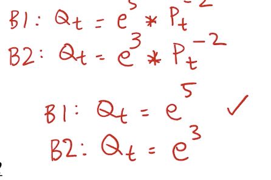

#### Price elasticity 

> Brand switching matrix video

The price elasticity represents the **percentage** by which the quantity demanded will **increase** if the price **decreased** by 1%

- Why it's the other way around
  - In reality, Why do prices change? Usually by discount 
  - It's more confident to come to the answer that when price decrease, what would the sales increase instead of the other way around

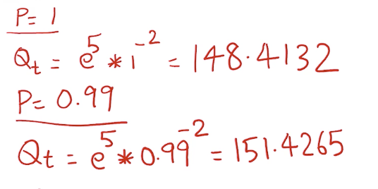

Percentage change in sales

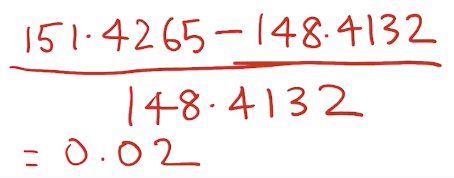

Percentage change in price

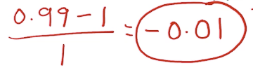

Price elasticity = 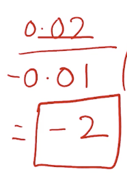

1. **Non-constant returns to scale**
   1. What does this mean?
      1. 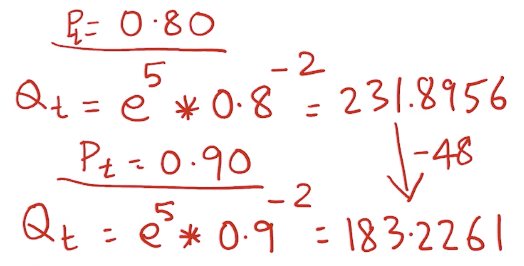
      2. Your next \$0.10 price increase will decrease sales less than your previous ​\$0.10 price increase
      3. 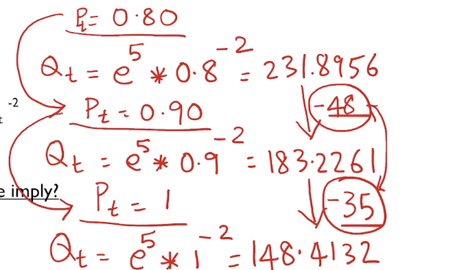
      4. We don't expect the next \$0.10 price increase to decrease sales by the same amount as the previous ​\$0.10 price increase. Or, for that matter, a ​\$0.10 price cut will not increase sales by the same constant amount, perpetually.
2. **Constant price elasticity** 
   1. Price elasticity=$\beta$ 
   2. **Constant** for your brand 
3. Returns to scale are about **absolutes**. The price elasticity is about **percentages**. 
   1. non-constant returns to scale says the following. If you cut the price of your brand by \$0.10, your sales would increase, let's say by some quantity, x. If you cut the price again by another ​\$0.10, the sales would now expand by a quantity that is not x. 
   2. Suppose you cut the price of your brand by 1% and let's say the sales expanded by x percent. If you cut the price of your brand by another 1%, your sales will again expand by x percent. So in terms of percentage increase in sales for a given percent price cut, the expansion always remains the same. 
   3. If you knew your brand's price  elasticity, you can choose the right price, what we call the optimal price, for your brand.

## Estimating the Scan*Pro Model

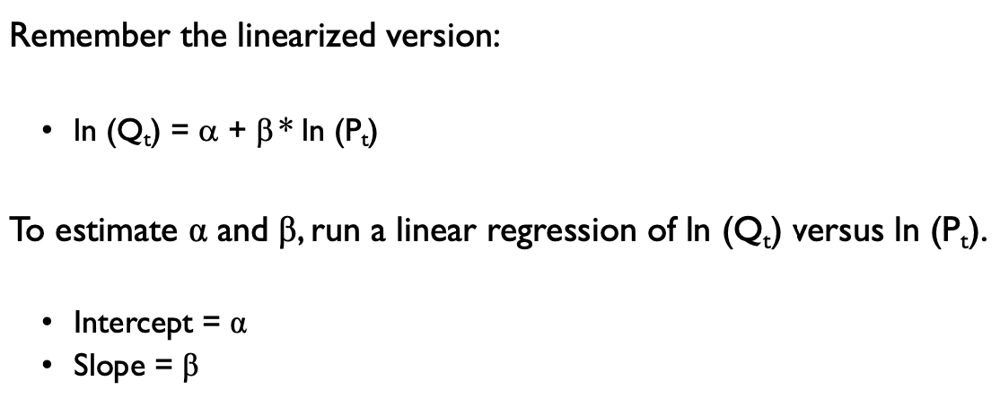

- How to get weekly sales and price data?
  - Either go to the retailer directly, 
  - or go to a third party data syndicator. (Nielsen, IRI)

## Further Extended Scan*Pro Model

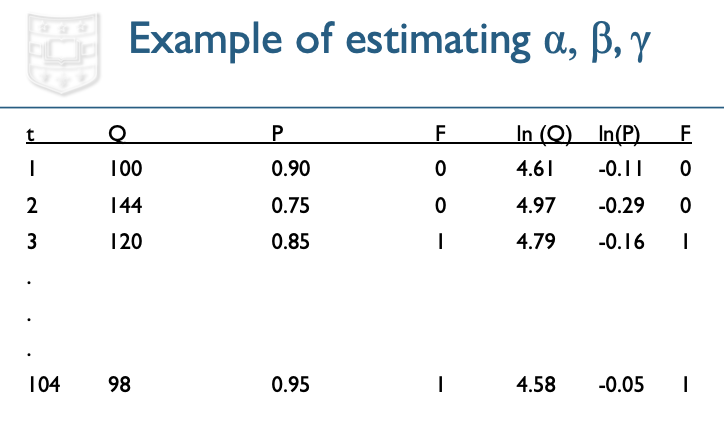

### $\gamma$ 

$\gamma$ = **feature advertising**, after applying exp operator to it; we call $exp(\gamma)$ a feature multiplier

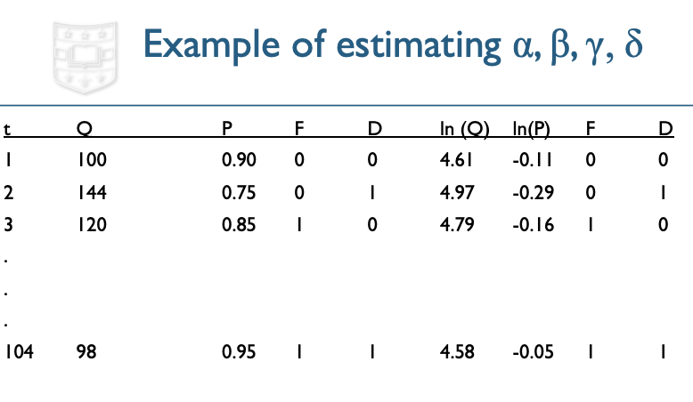

### $\delta$ 

$\delta$ = **display advertising** in the category aisle of the store. 

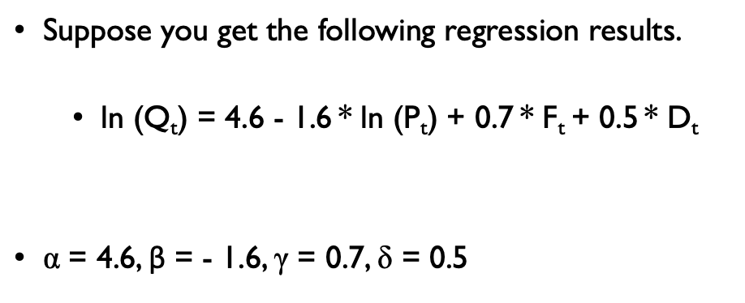

### How to interpret $\gamma$ = 0.7? 

First take the exp of $\gamma$, we get 2.1. 2.1 is the **feature multiplier** at the store. 

### How to interpret $\delta$ = 0.5? 

Exp of 0.5 is 1.65. 1.65 is a **display multiplier**. 

### The original version of equation

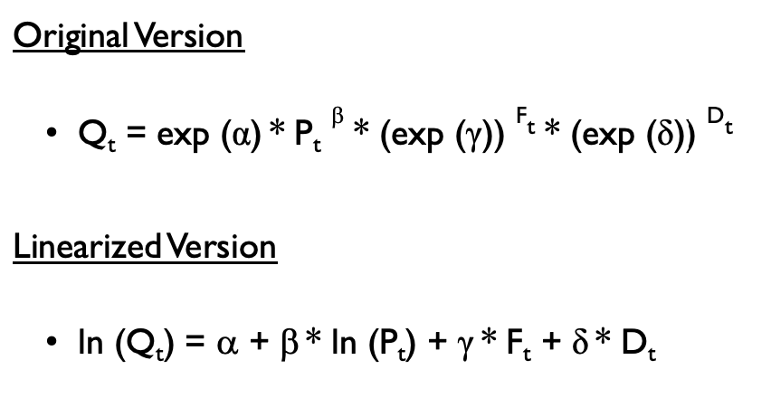

## Scan*Pro Brand Metrics (extended)

- **Price** Elasticity
- **Feature** Multiplier
- **Display** Multiplier 
- Brand Equity (<u>strength</u> of the brand, particularly using television advertising, print advertising)

Marketing mix model (because all of the parameters are the effects of marketing variables or marketing mix variables, on how much of the brand would sell)

## Final Generalization of the Scan*Pro Model

What if we have another variable representing competitor's brand?

Using perpetual map, we know which is our competitor, which is located closest to you. 

Generalized Scan*Pro Model is more accurate, because it's a more fully-specified model to predict your brand's sales. 

### Scan*Pro Brand Metrics

- Own Price Elasticity
  - The price of xxx decrease 1%, then the sales increase 1.15 ($\beta=-1.15$) 
  - The brand's cross price elasticity over the competitor is the brand's <u>**clout**</u> 
- Cross Price Elasticity
  - The competitors **decrease** its price by 1%, the brand **sales** will **decrease** by xxx%
  - It has to be **smaller** than **own** price elasticity, otherwise there may be somewhere wrong
  - It's the brand's **<u>vulnerability</u>** 
- Feature Multiplier
  - If the brand decides to **increase the feature advertising** in a given time, its sales will increase by a **multiple exp(xxx)**
- Display Multiplier
  - Sales will increase by a **multiple exp(xxx) times** if it chose to display advertise itself at the store in a given time
- Brand Equity
  - The brand will sell exp(xx) units in a given time at the store if it set a price of \$1 for its own brand, so did its competitor. 
- The model represents **baseline sales of the brand** at specific, chosen values of marketing variables where its **own price** as well as its **competitor's price** are each $1 and its **own feature** and **display advertising** are both 0.
- We choose to ignore the competitors' feature and display

-----------

## Lab

Suppose you were the manager of Maxwell: 

- **2-year** data 
  - enough data but not too old
- **Weekly** data, not monthly data, <u>definitely not daily</u> data
  - Advertising is made every week; the position is made weekly, not daily or monthly, too much noise for date-to-date data
  - Hundreds of monthly data are much harder and illogical
  - Price elasticity is roughly the same every month; impossible to estimate price elasticity 
- Why Folgers?
  - Because in the perceptual map, these are the closest brands in the map
- Store
  - Do scan*pro model to each store each time 
  - Different store might have different performance for the same brand

