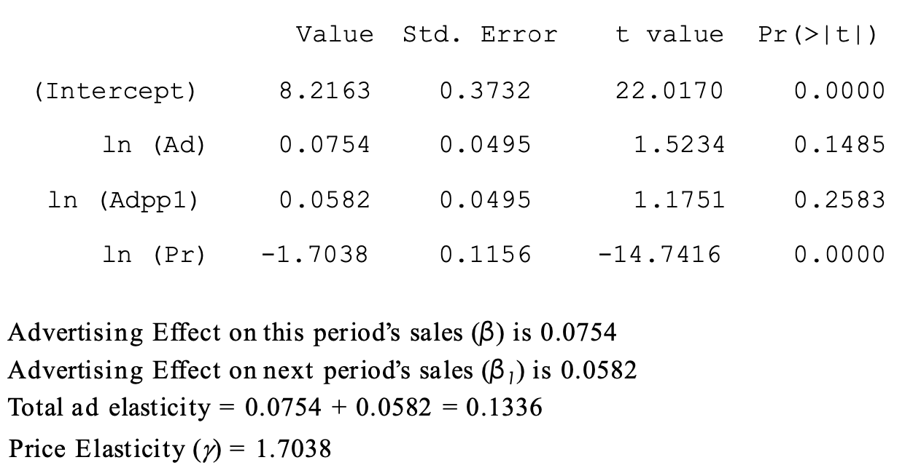

## l5.1 Advertising Decisions

Ad campaigns are evaluated by diverse criteria 

1. Brand Exposure

   Measures the investment of advertising on your brand; other 4 criteria measure the return, what's the impact of ad on your brand

   1. Reach
   2. Frequency \* (Ad manager buying <u>GRP</u>: gross rating points, total number of views that a particular ad xxx receives in the market)

2. Brand Recall (in early stages, **awareness**; if it increases after the ad, then we say the return on that investment is positive)

   1. Aided Recall
   2. Unaided Recall 

3. **Brand Attitude** (**interest**, how many consumers have positive feelings toward your brand; if it increases after the ad, then we say the return on that investment is positive)

4. **Brand Purchase Intent**  (**desire**, how likely for you to buy the brand; if it increases after the ad, then we say the return on that investment is positive)

5. **Brand Purchase** (**action**, use a scan pro model)

## 5.2 Plotting the Data 

Usually use 2 year data.

## 5.3 Linear Advertising Model

$Sales = \alpha+ (\beta×Ad) + (\gamma×Price)$ 

> T-value has to be larger than 2 in absolute value in order for us to use the interpretations. 

### Advertising Elasticity

It represents the **percentage change in sales** of a brand for a 1% change in its ad budget, or GRPs.

- The numerator represents the <u>percentage change in sales</u>. 
- The denominator, similarly, is the change in advertising scaled by the initial advertising, which makes this the <u>percentage change in advertising</u>.

> To calculate, we have to assume A0. But how about the price? We take average of historical data. 
>
> Both are true using A0=90GRP, A0=130GRP. If the current level of advertising on your brand is 90 GRPs, then you would expect the ad elasticity of your brand to be 0.097. If, on the other hand, your current level of ad investment on your brand is 130 GRPs, you would expect your ad elasticity to be 0.134. In other words, your brand's ad elasticity depends on your current level of advertising on your brand. And that is a property of the linear model that we have assumed.

## 5.4 Scan*Pro Advertising Model

The possibility of getting different elasticities with different values is troubling to some consultants. The following model does not have this problem.

Suppose we estimate this model and we get:

Unlike the linear model, the scan\*pro model gives us the **same** exact number of ad elasticity regardless of A0. **Scan\*pro model is Constant elasticity model; but linear model is a Constant returns-to-scale model,** which is a rather bad assumption. We never find any marketing variables having constant returns to scale. Your next GRP will not increase your sales by the same number of units as the previous GRP. There is <u>always diminishing returns</u> to any marketing investment. (Percent)

## 5.5 Running the Scan*Pro Advertising Model

### $\beta$ : advertising elasticity 

reflects the influence of logarithm of advertising on the logarithm of sales. So that's the advertising elasticity of the Estee Lauder brand. This means that as Estee Lauder **increases** its advertising exposure in a week by 1%, it's weekly sales that week will **increase** by 0.0851%. 

Even though it's small, it doesn't mean it's useless. 

### $\gamma$: price elasticity

reflects the influence of logarithm of price on logarithm of sales. That represents Estee Lauder's price elasticity. This means that as Estee Lauder **decreases** its price by 1% in a given week, its sale's that week will **increase** by 1.7113%. 

### Price effect first; Price elasticity is much larger than ad elasticity

the price elasticity is one order of **magnitude** larger than the ad elasticity. And that is fairly typical with brands in all product categories. 

### $\alpha$: brand equity

if you calculate **exp** of $\alpha$, which in this case would be... that turns out to be about that. So 4,715 represents the baseline national sales that Estee Lauder will have in a given week if its average price, nationally, is $1 and its national advertising exposure is 1 GRP.

### Common Data Issue

For periods with **zero** advertising what do we do?

- Replace each zero value with <u>**0.01**</u> times the **average (weekly) advertising value** (averaging only over all non-zero advertising values).
- Still take logarithm 

## 5.6 Dynamic Carryover Effects of Advertising

### Types of Effects of Ad Exposure

> Sales, unless qualified, always represent <u>volume of sales</u>, or **quantity** sold, not dollar sales. Otherwise, revenues.

### Instantaneous effect of advertising

- Black line: baseline
- Red line: the current impact of advertising

Brand sales, which used to be at the baseline, shoot up during week 6 because of this ad exposure. And in subsequent weeks, sales revert back to the baseline.

### Consumers tend to remember advertising from the past week (Dynamic carry over effect of advertising; commonest type)

- Green line: sales go from the base line by that spike upward because of the ad exposure during week 6. But during week 7, sales do not return to the baseline. They remain high. Not as high as in week 6, but still high, even though there is no ad exposure. in week 7. The glow of advertising persists. 
- it takes a bit of time before sales revert back to the baseline. 

###  Long carry over effect of advertising

- Yellow line: It's similar to the green curve, except brand sales continue to be high for a long, long time after that campaign. So in that sense, this says advertising has a much more lingering impact into the future than does this curve. 

### Dynamic carry over effect of advertising within scan*pro model

#### Advertising seems to have a delayed impact on sales

A price decrease in a given week will not impact brand sales in subsequent weeks when the price decrease no longer exists. However, an ad exposure in a given week will impact brand sales in subsequent weeks even when the ad campaign no longer exists. 

## 5.7 Handling Carryover Effect

## 5.8 Handling More Carryover

##### Modify the Scan*Pro model to expand the dynamic carry-over effect beyond just one period. 

By including one more independent, or x, variable in this regression. So this is logarithm of Adpp2, and Adpp2 represents advertising from previous period two, or two weeks ago. 

> 0.0751 reflects the instantaneous ad elasticity of the brand. 
>
> The second number, 0.0527, reflects the one week dynamic carry over elasticity of the brand. 
>
> The third number, 0.0358, reflects the two weeks dynamic carry over elasticity of the brand.

### Triple whammy

If xx increases its national advertising in a given week by 1%, its sales in that same week will increase by 0.0751%. Furthermore, its sales in the next week will also increase to the tune of 0.0527%. And furthermore, still, the sales two weeks later will also increase, this time to the tune of 0.0358%.

So if advertising goes up by 1%, weekly sales effectively increase to the tune of 0.1636%. 

##### Advertising in a given week impacts not only that week's sales, but also next week's sales and two weeks later sales. 

## 5.9 Handling Infinite Carryover

-  As we introduce more and more lags, the number of observations for the regression decreases.
- Number of coefficients keeps on increasing. 
- Strong potential for multicollinearity.

#### Advertising, or the effectiveness of advertising, depreciates at a constant rate from one period to the next.

## 5.10 Search Engine Advertising (SEA)

CPM / CPC

### Advertisers' Tasks in SEA

##### The more you bid, the better the rank you get. The better the rank you get, the more clicks you get. 

## 5.11 Calibration of Response Functions

### Price response function

reflects the relationship between how much you bid on that keyword and the rank that your ad received as a function of that bid. 

- Left-side: AVERAGE COST-PER-CLICK. the logarithm of the cost-per-click, that keyword, k, which in this case is cruise vacation received on day t. The average cost-per-click that you incurred on this keyword on day t averaged over the 24 hours.
- Righthand side: the average rank that your ad received that day. 
- The left-hand side reflects **how much you paid** Google, per-click, and the right-hand side reflects **what that payment got you** in terms of the rank that your search ad received. 

##### Interpretation 

- |                        |              Coefficients               |
  | :--------------------: | :-------------------------------------: |
  |       Intercept        |               0.61429368                |
  |      Average rank      |               -0.1815604                |
  | Rank Multiplier of CPC | 0.8339679=exp(average rank coefficient) |

- If rank increases by 1 unit (1 rank below), then the CPC will become exp(-0.1815604)=0.83 times what it used to be. Equal to 17% of cost lower than before. 

- We don't take logarithm of rank, so it's <u>not elasticity</u>, not about percentage but the <u>multiplier</u>. 

### Click response function

reflect the relationship between the rank of your ad and the number of clicks received by your ad.

- **CTR** stands for click-through rate, which is what percentage of the time that your ad was displayed was it clicked on

##### Interpretation

- |                        | Coefficients |
  | :--------------------: | :----------: |
  |       Intercept        |  -2.2422972  |
  |      Average rank      |  -0.3072315  |
  | Rank Multiplier of CTR |  0.73548034  |

  If rank increases by 1 unit (1 rank below), then the CPC will become exp(-0.3072315)=0.73548034 times what it used to be. Equal to 27% of cost lower than before. 

- exp(Intercept) is like a **baseline**, it's the highest possible CTR you need to pay.  

### Tradeoff

If you're ranked number 2 rather than number 1, you're gonna pay less to Google on a cost-per-click basis. You're going to pay that much less as a multiple, but you're going to get fewer clicks, as well, by that multiple.

### Response Functions

They are both **convex** toward the origin.

