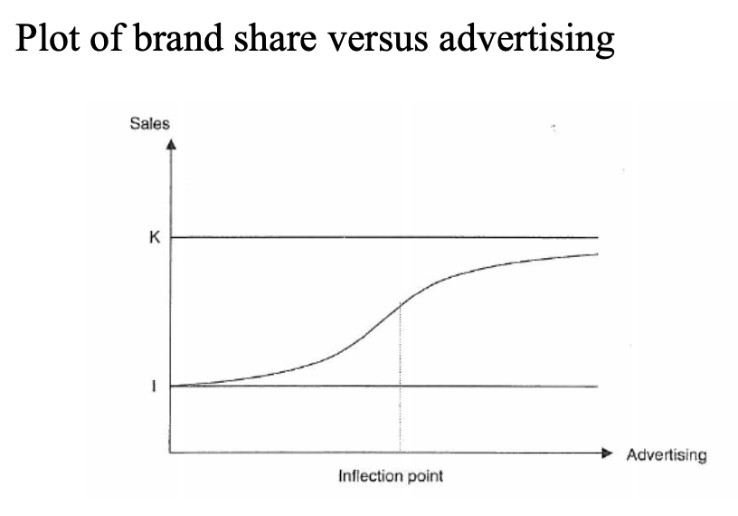
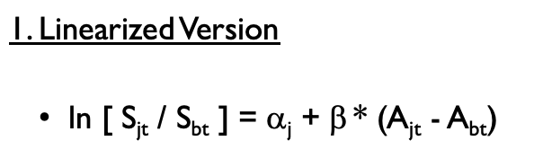
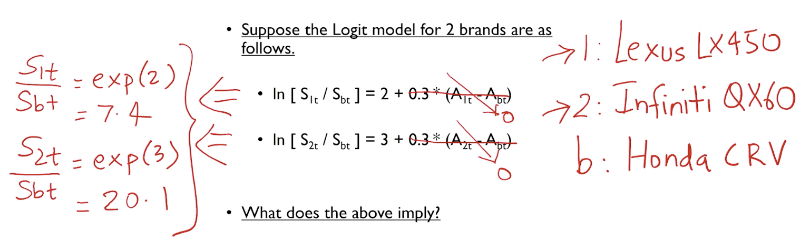
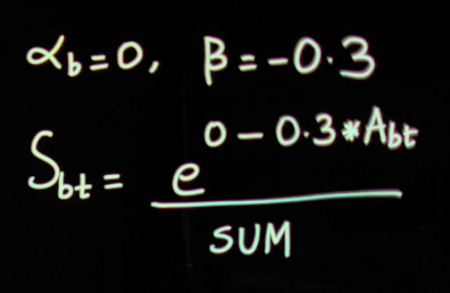
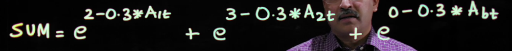

## 6.1 Introducing the Logit Model

If the brand is still growing and not mature, the scan\*pro model is inappropriate. In that case, you need to separate the bass model on the one hand and the logit model on the other hand. The Bass Model will forecast product category sales. The logit model will forecast market share for your brand.

##### The logit model is a representation of how a brand's market share depends on a brand's marketing mix variable.

### Logit Curve 

K=1: no matter how much you advertise, your market share will never go above that line, which represents a market share of 1

Intercept I: no matter how little you advertise, this curve is never going to go below 0 because market share is bounded on the lower end by 0; When advertising is 0, the brand still obtains positive market share. 

#### Not linear

Each additional dollar expenditure, or each additional GRP, increases market share more than the previous dollar expenditure. 

Every additional dollar does not boost market share by the same amount, so you have **increasing returns**, **linear returns**, and eventually **diminishing returns**. 

## 6.2 Explicating the Logit Model

### Logit model

- Left-hand side: that ratio as representing **your** brand's market share divided by **the base** brand's market share, both in period t. 
- Right-hand side: the difference between the advertising expenditure of your brand, brand j, in week t, and the advertising expenditure of that base brand, b, in that same week, t. 
- $\alpha_j$: <u>**brand equity**</u> of brand j (<u>different</u> alpha for different brand)
- $\beta$: **<u>advertising sensitivity</u>** of consumers in this **product category,** not necessarily your brand (the <u>same</u> beta for the same product) (must be **positive** for advertising sensitivity )
- *Can have a price sensitivity but not in this version (price sensitivity is negative)* 
- How to **pick a base brand**:
  - Usually pick a small brand as a base brand (small market share)
  - Base brand <u>must be available</u> through the whole period 
  - But choice is not critical. 

### Logit property

#### Non-constant returns to scale (absolute)

According to this model, suppose you increase the advertising expenditure on your brand, or the advertising exposures for your brand, from 100 GRPs to 200 GRPs, and let's say your market share, your brand's market share, increases from 0.5 to 0.6. So 100 GRPs of additional advertising exposures increases your market share by 0.1.

Suppose you increase your advertising by another 100 GRPs, so you go from 200 to 300 GRPs. Now you notice that your market share increases by 0.05. This is what we call non- constant returns to scale. In this case, 100 additional GRPs increased market share by 0.1. In this case, 100 additional GRPs increased market share by less than 0.1, only by 0.05. 

**A given increase in advertising does not always increase market share by the same amount.** 

#### <u>Non</u>-constant advertising elasticity (percentage)

Suppose you increase the advertising on your brand in a given week by 1%, and let's say your market share increases by 1%, and you decide to increase advertising that week by another 1%. This time, the market share increases by only 0.8%, so these two responses are not the same. 

The first increase in advertising to the tune of 1%, increased market share by 1%. The second increase of advertising, again to the tune of 1%, did not increase market share by 1%. It increased market share only by 0.8%. 

## 6.3 Interpreting the Logit Model

## 6.4 Logit Model in Its Original Version

Base alpha = 0

Other alphas interpreted over base alpha. If $\alpha_i<0=\alpha_b$, then it has lower brand equity than base brand. 

### Base market share

> $\beta$ Should be +0.3

Three market **shares** added together is 1. 

$e^{0+0.3*A_{bt}}$ = your brand attractiveness

Sum = attractiveness of the product line

In order to make the forecast, you don't only need to know your own advertising, you should also know your competitor's advertising. 

Linearized version is useful when estimating parameters on historical data. 

## 6.5 The SUV Market in the U.S. 

### Diffusion of SUV Brands

----------------

## Lab

- When marketing is **growing**, we use bass model (category growth) + market share using logit model
- When marketing is **mature**, there's no more new adopters, we use scan\*pro model (forecasting brand sales)
- If you need to forecast market share, you have to know every brand's alphas and betas, you have to run regression on all brands
- The base brand must remain the same for all brands' logit model
- We assume brand 9 (base brand) brand equity as 0, so we usually use a small brand; the absolute position is not unique, the **relative** position is unique. 
- When calculating beta, we use indicating variables and set constant as 0, then run the regression. 

---------------------

> 1 hour open book / 1 hour close book
>
> Final exam next Monday / Tuesday / Wednesday 6:15-8:15 bh330 / Thursday 2:30-4:30 sh106
>
> By noon tomorrow send an email how many at what time

