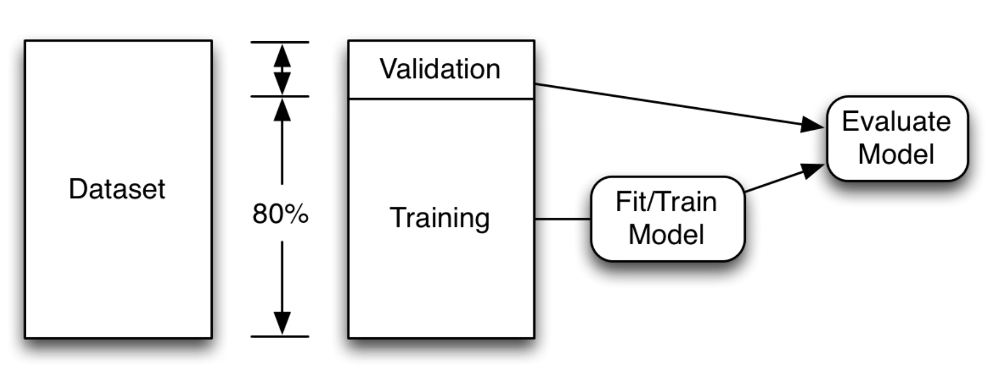

## Building and Training a Model

> Data set: IRIS 

### Setting up a model

```python
a = Input(shape=(32,))
b = Dense(32)(a)
model = Model(inputs=[a1, a2], outputs=[b1, b2, b3])
```

Or we could simply "**<u>from tensorflow.keras.models import Sequential</u>**" 

```python
## build neural network
model=Sequential()
```

### Setting up hidden layers

In the first hidden layer, you should indicate the input dimension **<u>input_dim</u>** , which would be the number of inputs.

```python
## hidden 1; 50 neurons; input dimension should be the number of inputs 
model.add(Dense(50,input_dim=x.shape[1],activation="relu")) 

## hidden 2; 
model.add(Dense(25,activation="relu"))
```

### Compile the model

```python
compile(optimizer, loss=None, metrics=None, loss_weights=None, sample_weight_mode=None, weighted_metrics=None, target_tensors=None)
```

**Arguments**

- **optimizer**: String (name of optimizer) or optimizer instance. See [optimizers](https://keras.io/optimizers).
- **loss**: String (name of objective function) or objective function or `Loss` instance. See [losses](https://keras.io/losses). If the model has multiple outputs, you can use a different loss on each output by passing a dictionary or a list of losses. The loss value that will be minimized by the model will then be the sum of all individual losses.
- **metrics**: List of metrics to be evaluated by the model during training and testing. Typically you will use `metrics=['accuracy']`. To specify different metrics for different outputs of a multi-output model, you could also pass a dictionary, such as `metrics={'output_a': 'accuracy', 'output_b': ['accuracy', 'mse']}`. You can also pass a list (len = len(outputs)) of lists of metrics such as `metrics=[['accuracy'], ['accuracy', 'mse']]` or `metrics=['accuracy', ['accuracy', 'mse']]`.
- **loss_weights**: Optional list or dictionary specifying scalar coefficients (Python floats) to weight the loss contributions of different model outputs. The loss value that will be minimized by the model will then be the *weighted sum* of all individual losses, weighted by the `loss_weights` coefficients. If a list, it is expected to have a 1:1 mapping to the model's outputs. If a dict, it is expected to map output names (strings) to scalar coefficients.
- **sample_weight_mode**: If you need to do timestep-wise sample weighting (2D weights), set this to `"temporal"`. `None` defaults to sample-wise weights (1D). If the model has multiple outputs, you can use a different `sample_weight_mode` on each output by passing a dictionary or a list of modes.
- **weighted_metrics**: List of metrics to be evaluated and weighted by sample_weight or class_weight during training and testing.
- **target_tensors**: By default, Keras will create placeholders for the model's target, which will be fed with the target data during training. If instead you would like to use your own target tensors (in turn, Keras will not expect external Numpy data for these targets at training time), you can specify them via the `target_tensors` argument. It can be a single tensor (for a single-output model), a list of tensors, or a dict mapping output names to target tensors.
- ***\*kwargs**: When using the Theano/CNTK backends, these arguments are passed into `K.function`. When using the TensorFlow backend, these arguments are passed into `tf.Session.run`.

#### loss

- **mean_squared_error**
- mean_absolute_error
- mean_absolute_percentage_error
- mean_squared_logarithmic_error
- ...
- **categorical_crossentropy** 
  -  **Note**: when using the `categorical_crossentropy` loss, your targets should be in categorical format (e.g. if you have 10 classes, the target for each sample should be a 10-dimensional vector that is all-zeros except for a 1 at the index corresponding to the class of the sample). In order to convert *integer targets* into *categorical targets*, you can use the Keras utility `to_categorical`:
- sparse_categorical_crossentropy
  - When using the `sparse_categorical_crossentropy` loss, your targets should be *integer targets*. If you have categorical targets, you should use `categorical_crossentropy`.
- binary_crossentropy
- poisson

### Fit the model

```
model.fit(x,y,verbose=2,epochs=100)
```

- **epochs**: Integer. Number of epochs to train the model. An epoch is an iteration over the entire `x` and `y` data provided. Note that in conjunction with `initial_epoch`, `epochs` is to be understood as "final epoch". The model is not trained for a number of iterations given by `epochs`, but merely until the epoch of index `epochs` is reached.
- **verbose**: Integer. 0, 1, or 2. Verbosity mode. 0 = silent, 1 = progress bar, 2 = one line per epoch.

## Prediction

### One-hot encoding

Each row has only 1.0 value because each row is only one type of iris.  This is called one-hot encoding.  **Only one value is 1.0 (hot)** 

### argmax()

In this case, we only need to know the maximum number in three columns, which indicated 1 (the species it belongs to). So we could use **argmax()** to find the column containing the maximum number. 

If it's 2D array, we have to indicate `axis=1` to make sure it finds the maximum number for each row and returns its column index. 

### turn off the scientific notation
```python
np.set_printoptions(suppress=True)
```

### accuracy score

```python
from sklearn.metrics import accuracy_score
correct=accuracy_score(expected_classes,predicted_classes)
print(f"Accuracy:{correct}")
```

Accuracy might be a more easily understood **error metric**.  It is essentially a test score.  For all of the iris predictions, what percent were correct?  The downside is it does not consider how confident the neural network was in each prediction.

### Predict one sample

```python
sample_flower=np.array([[5,3,4,2]],dtype=float)
pred=model.predict(sample_flower)
print(pred)

pred=np.argmax(pred)
print(f"Predict that {sample_flower} is: {species[pred]}")
```

### Predict two samples (point out axis=1)

```python
## predict two samples
sample_flower = np.array( [[5.0,3.0,4.0,2.0],[5.2,3.5,1.5,0.8]], dtype=float)
pred=model.predict(sample_flower)
print(pred)

pred=np.argmax(pred,axis=1)
print(f"Predict that {sample_flower} is: {species[pred]}")
```

## Save a neural network

- **YAML** - Stores the neural network structure (no weights) in the [YAML file format](https://en.wikipedia.org/wiki/YAML).
- **JSON** - Stores the neural network structure (no weights) in the [JSON file format](https://en.wikipedia.org/wiki/JSON).
- **HDF5** - Stores the complete neural network (with weights) in the [HDF5 file format](https://en.wikipedia.org/wiki/Hierarchical_Data_Format). Do not confuse HDF5 with [HDFS](https://en.wikipedia.org/wiki/Apache_Hadoop). They are different. We do not use HDFS in this class.

### Usually save in HDF5.

```python
import io
import os

# save neural network structure to JSON (no weights)
model_json = model.to_json()
with open(os.path.join(save_path,"network.json"), "w") as json_file:
    json_file.write(model_json)

# save neural network structure to YAML (no weights)
model_yaml = model.to_yaml()
with open(os.path.join(save_path,"network.yaml"), "w") as yaml_file:
    yaml_file.write(model_yaml)

# save entire network to HDF5 (save everything, suggested)
model.save(os.path.join(save_path,"network.h5"))
```

## Load the neural network

```python
from tensorflow.keras.models import load_model
model2 = load_model(os.path.join(save_path,"network.h5"))
pred = model2.predict(x)
# Measure RMSE error.  RMSE is common for regression.
score = np.sqrt(metrics.mean_squared_error(pred,y))
print(f"After load score (RMSE): {score}")
```

## Early Stopping to prevent overfitting

- **Training Set**

- **Validation Set**

- **Holdout Set**

- 

  Split into validation and training datasets

### [`sklearn.model_selection`](https://scikit-learn.org/stable/modules/classes.html#module-sklearn.model_selection).train_test_split

- ***arrays***: sequence of indexables with same length / shape[0]
  - Allowed inputs are lists, numpy arrays, scipy-sparse matrices or pandas dataframes.

- **test_size**: float, int or None, optional (default=None)
  - If float, should be between 0.0 and 1.0 and represent the **proportion** of the dataset to include in the test split. If int, represents the absolute number of test samples. If None, the value is set to the complement of the train size. If `train_size` is also None, it will be set to 0.25.

- **train_size**: float, int, or None, (default=None)
  - If float, should be between 0.0 and 1.0 and represent the proportion of the dataset to include in the train split. If int, represents the absolute number of train samples. If None, the value is automatically set to the complement of the test size.
- **random_state**: int, RandomState instance or None, optional (default=None)
  - If int, random_state is the seed used by the **random number** generator; If RandomState instance, random_state is the random number generator; If None, the random number generator is the RandomState instance used by `np.random`.

- **shuffle** boolean, optional (default=True)
  - Whether or not to shuffle the data before splitting. If shuffle=False then stratify must be None.

- **stratify** array-like or None (default=None)
  - If not None, data is split in a stratified fashion, using this as the class labels.

```python
from sklearn.model_selection import train_test_split
x_train,x_test,y_train,y_test=train_test_split(x,y,test_size=0.25,random_state=42)
```

