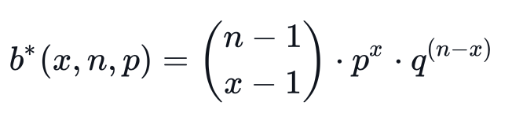
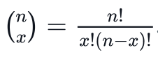
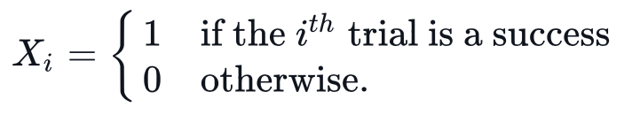
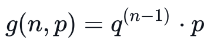

### Day 4: Geometric Distribution

#### Negative Binomial 负二项分布

“负二项分布”与“二项分布”的区别在于：“二项分布”是固定试验总次数N的独立试验中，成功次数k的分布；而“负二项分布”是所有到失败r次时即终止的独立试验中，成功次数k的分布。

#### Negative Binomial Experiment

A negative binomial experiment is a statistical experiment that has the following properties:

- The experiment consists of $n$ repeated trials.
- The trials are independent.
- The outcome of each trial is either *success* ($s$) or *failure* ($f$).
- $P(s)$ is the same for every trial.
- The experiment continues until successes are observed.

If $X$ is the number of experiments until the $x^{th}$ success occurs, then $X$ is a discrete random variable called a *negative binomial*. 

#### [Negative Binomial Distribution](https://en.wikipedia.org/wiki/Negative_binomial_distribution) 负二项分布

Consider the following probability mass function: 

The function above is *negative binomial* and has the following properties:

- The number of successes to be observed is $x$.
- The total number of trials is $n$.
- The probability of success of trial is $p$.
- The probability of failure of trial , where $q=1-p$.
- $b*(x,n,p)$ is the *negative binomial probability*, meaning the probability of having successes after trials and having successes after trials. 

**Note:** Recall that  

#### [Geometric Distribution](https://en.wikipedia.org/wiki/Geometric_distribution) 几何分布

The *geometric distribution* is a <u>special case of the negative binomial distribution</u> that deals with the number of Bernoulli trials required to get a success (i.e., counting the number of failures before the first success). Recall that $X$ is the number of successes in $n$ independent Bernoulli trials, so for each $i$ (where $1≤i≤n$):

The geometric distribution is a negative binomial distribution where the number of successes is 1. We express this with the following formula:

